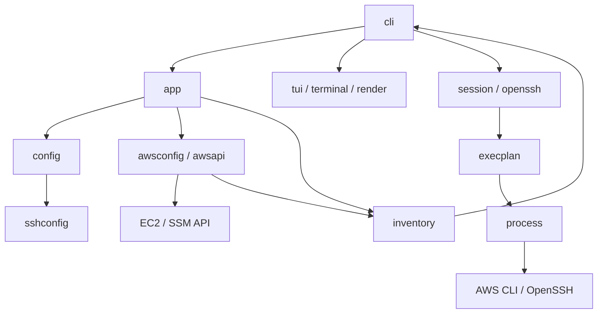

# アーキテクチャ

本ドキュメントは、現行実装のパッケージ構成、検索と接続の実行経路、外部システムとの境界を説明する。

## 構成

エントリポイントは `cmd/ssmm` である。設定ストア、AWS 接続、実行計画、外部プロセスの実装を組み立てて CLI に渡す。`app` はインターフェースを通して設定と AWS を使用し、具象の AWS SDK や設定ファイル操作には依存しない。

パッケージの責務を、以下にまとめる。

| パッケージ | 責務 |
| --- | --- |
| `cmd/ssmm` | 依存関係の組み立て、実行ファイルのパス取得、最終的な終了コード |
| `internal/cli` | Cobra のコマンド、引数検証、対話操作の制御、一覧出力、接続処理の呼び出し |
| `internal/app` | 設定・AWS のインターフェース、検索準備、リージョン解決、検索結果からの対象確定 |
| `internal/target` | プロファイル指定元、インスタンス、検索条件、照合、並び順 |
| `internal/config` | TOML、パス解決、設定の検証、保存と排他制御 |
| `internal/awsconfig` | AWS 認証設定のロード、プロファイル検証、リージョン別クライアント |
| `internal/awsapi` | EC2・SSM API、ページネーション、内部モデルへの変換 |
| `internal/inventory` | リージョンの並行取得、イベント集約、スナップショットと進捗 |
| `internal/tui` | Bubble Tea による対話選択、入力と検索結果の表示 |
| `internal/terminal` | `/dev/tty` の取得と利用可否の判定 |
| `internal/render` | 表の整列、表示幅、制御文字のエスケープ |
| `internal/session` | AWS CLI による通常セッションと SSH セッションの実行計画 |
| `internal/openssh` | SCP オペランド解析、SSH・SCP の実行計画、proxy 引数の引用 |
| `internal/proxy` | `.ssmm` ホスト名と内部 proxy 引数の解析 |
| `internal/sshconfig` | 標準 SSH 連携の設定生成と Include の編集 |
| `internal/execplan` | 外部プロセスの実行計画、入出力、環境変数ポリシー、結果の型 |
| `internal/process` | 外部プロセスの起動、端末とシグナル、終了待機 |

主要な実行経路を、次の図に示す。矢印は処理やデータの流れを表す。

## 検索と選択

検索準備では、CLI フラグと任意で選択した ssmm プロファイルから AWS プロファイル、検索条件、有効なリージョンを解決する。ssmm プロファイルの指定がなければ設定ファイルを読み込まない。認証設定の検証と AWS SDK の生成には AWS プロファイルを使い、検索範囲と SSH の既定値には ssmm プロファイルを使う。AWS SDK の設定は検索ごとに生成し、リージョン別の EC2・SSM クライアントを同じ実行単位内で再利用する。

`inventory` は各リージョンの取得結果をイベントに変換する。集約処理だけが結果のマップと進捗を更新し、読み取り側に複製したスナップショットを渡す。インスタンスの識別キーはリージョンとインスタンス ID の組である。

`cli` は非対話の場合に最終結果を待つ。対話の場合はスナップショットを `tui` に渡し、`InstanceKey` に基づく選択結果を受け取る。検索世代の終了と次の世代の開始も `cli` が制御する。`tui` は `app` の UI 抽象化を経由せず、CLI が直接使用する。

状態と取得完了の判定の詳細は、[仕様のインベントリ](specification.md#インベントリ) を参照。

## 接続と外部コマンド

接続先の確定後は、Name の再検索を行わずリージョンとインスタンス ID を使う。通常の Session Manager 接続は AWS CLI を起動する。SSH・SCP は OpenSSH を起動し、その `ProxyCommand` が内部 proxy を経由して AWS CLI を起動する。

SSH 接続時の外部プロセスの関係を、次の図に示す。

`session` と `openssh` は実行計画を生成する。SSH・SCP の要求型と SCP 転送データは `app` の型を使用する。実際の起動と終了処理は `process` が行う。標準入出力は子プロセスへ渡し、proxy の通信データを ssmm が行単位で解析する処理はない。

外部実行の引数と環境変数の契約は、[仕様の外部コマンド](specification.md#外部コマンド) を参照。

## 設定保存

`config` が設定と SSH ファイルの更新を調整する。`init` は ssmm 設定だけを更新し、`ssh-config create` / `delete` は SSH ファイルも更新する。`sshconfig` は更新するバイト列を生成し、ファイルを書き込まない。保存前に全プロファイルを検証し、SSH ファイルを更新する場合は生成も済ませる。ファイル単位の置換を順番に行う。

保存時の競合検出と部分失敗の扱いは、[仕様の設定保存](specification.md#設定保存) を参照。

## コードの参照先

処理を追う際の起点を、以下にまとめる。

| 対象 | 起点 |
| --- | --- |
| 依存関係の組み立て | [cmd/ssmm/main.go](../../cmd/ssmm/main.go) |
| CLI と検索・選択 | [internal/cli/root.go](../../internal/cli/root.go) |
| SSH・SCP・proxy・init | [internal/cli/commands.go](../../internal/cli/commands.go) |
| 標準 SSH 設定の作成・削除 | [internal/cli/ssh_config.go](../../internal/cli/ssh_config.go) |
| 検索準備 | [internal/app/service.go](../../internal/app/service.go) |
| 候補からの対象確定 | [internal/app/resolve.go](../../internal/app/resolve.go) |
| 検索の並行取得 | [internal/inventory/run.go](../../internal/inventory/run.go) |
| 検索結果の集約 | [internal/inventory/aggregate.go](../../internal/inventory/aggregate.go) |
| 設定と SSH ファイルの保存 | [internal/config/appstore.go](../../internal/config/appstore.go) |
