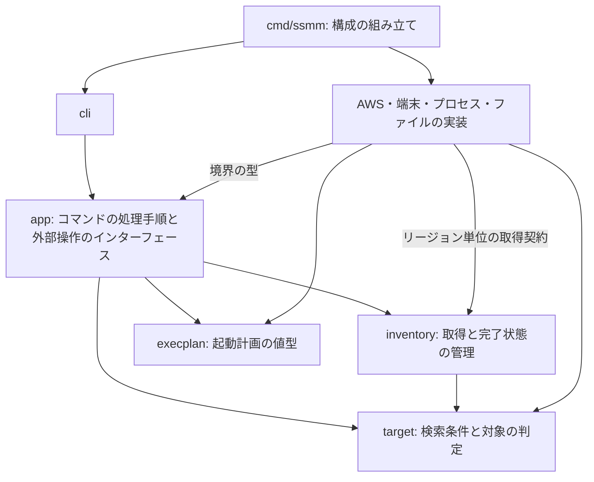
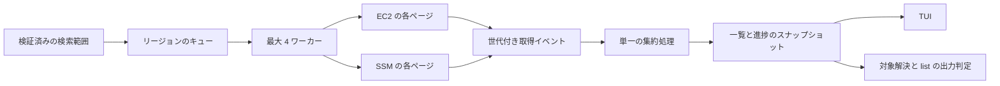

# ssmm 実装アーキテクチャ

> [!NOTE]
> 本ドキュメントは実装前の設計記録である。現行の構成は [アーキテクチャ](../architecture.md)、動作仕様は [仕様](../specification.md) を参照。

本ドキュメントは、ssmm の初版を実装するためのパッケージ構成、データモデル、処理の実行順序、外部システムとの境界を定義する。ここで定義する構成は実装予定である。

## 設計方針

単一の Go バイナリに、検索と選択のアプリケーション処理、および AWS API・端末・外部コマンドへの接続を実装する。アプリケーション処理から外部ライブラリを分離し、検索結果と接続先の決定を AWS アカウントや実端末なしで検証できる構成とする。

コマンドの外形的な仕様と対象範囲の詳細は、[DESIGN.md](DESIGN.md) を参照。実装の順序と各段階の完了条件の詳細は、[IMPLEMENTATION.md](IMPLEMENTATION.md) を参照。

実装全体で維持する条件を、以下に示す。

| 条件 | 実装上の扱い |
| --- | --- |
| 検索範囲の固定 | 処理開始時に範囲と設定元を確定し、検索中に変更しない |
| 検索完了と接続可能性の分離 | EC2 の全ページ取得、SSM 情報の取得、EC2 の稼働状態を別々に管理する |
| 一意性の確認 | 自動選択には検索範囲内の EC2 取得成功を必要とする |
| 接続先の固定 | 選択後はプロファイル、リージョン、インスタンス ID を保持する |
| 認証経路の維持 | プロファイル名と指定元を AWS SDK、AWS CLI、内部 proxy の間で引き継ぐ |
| 通信と表示の分離 | proxy の標準入出力を通信専用とし、TUI には操作端末を使う |

永続キャッシュ、バックグラウンドサービス、独自の SSH 実装は導入しない。セッション通信は AWS CLI v2 と Session Manager plugin、SSH 認証と転送は OpenSSH に委譲する。

## パッケージ構成

アプリケーション層は必要な外部操作を小さなインターフェースとして定義する。エントリーポイントが実装を組み立て、CLI に渡す。インターフェースは利用するパッケージに置き、AWS SDK の型や Bubble Tea のメッセージを境界の外へ公開しない。

ファイル単位の配置、型の所有先、インターフェースの詳細は、[CODE_STRUCTURE.md](CODE_STRUCTURE.md) を参照。

依存の方向を図示すると、次の図のようになる。矢印は Go パッケージの依存方向であり、処理の呼び出し順序ではない。

配置と責務を、以下にまとめる。

| パス | 責務 |
| --- | --- |
| cmd/ssmm/ | 依存の組み立て、最上位の後処理、終了コードの返却 |
| internal/cli/ | Cobra のコマンド定義、引数の構文検証、ヘルプ、一覧と診断の出力 |
| internal/app/ | 設定解決、検索、選択、接続、初期設定の処理手順と入出力契約 |
| internal/target/ | 対象とインスタンスの型、完全一致、タグ条件、部分一致、安定ソート、選択可否の判定 |
| internal/inventory/ | 最大並行数、世代付き通知、リージョン別進捗、結果集約、EC2 と SSM の結合 |
| internal/awsconfig/ | AWS プロファイルの存在確認、SDK の設定、認証経路、リージョン別クライアントの構成 |
| internal/awsapi/ | DescribeRegions、EC2・SSM のページネーション、SDK 型とエラーの変換 |
| internal/config/ | TOML の読み書き、ssmm プロファイルの検証、パスの解決、初期設定の複数ファイル保存 |
| internal/tui/ | Bubble Tea による一覧と初期設定フォーム、取得イベントの表示への変換 |
| internal/session/ | シェル接続と AWS-StartSSHSession に必要な AWS CLI 引数の生成 |
| internal/openssh/ | ssh・scp の実行計画、転送指定の解析、ProxyCommand のエンコード |
| internal/proxy/ | 標準 SSH ホスト名と内部呼び出しの構文解析、引数の検証 |
| internal/sshconfig/ | 管理用 SSH 設定と Include の生成。ファイルへの保存は config が行う |
| internal/execplan/ | 実行ファイル、argv、環境ポリシー、実行方式、終了結果の値型 |
| internal/terminal/ | 操作端末の取得、端末状態の保存と復元 |
| internal/process/ | 外部コマンドの起動、入出力の接続、プロセスとシグナルの管理 |

inventory はリージョン単位の取得インターフェースを利用する。awsapi がその実装としてページを読み、アプリケーション用のデータを返す。これにより、ページネーションの API 依存部分と並行取得の制御を別々に検証できる。

app は cli、config、tui、awsconfig、awsapi、session、openssh、process の具象実装を import しない。session と openssh は execplan の起動計画を返し、app が注入された実行インターフェースを通して process を呼び出す。proxy は純粋なパーサーであり、名前解決、非対話の制約、セッションの開始は app に集約する。config が初期設定の保存を調整し、sshconfig は保存予定のバイト列だけを返す。

パッケージは対応する機能の実装時に追加する。汎用リポジトリ層、共通サービス基底型、依存注入フレームワークは設けない。

## データモデル

検索入力、取得途中の状態、接続先を別の型で表す。入力文字列から接続処理まで Name だけを渡し続ける構成にはしない。

主な型と保持する情報を、以下にまとめる。型名は実装時の候補である。

| 型 | 情報と制約 |
| --- | --- |
| ProfileSelection | プロファイル名、指定元。指定元はフラグ、SSH ホスト名、環境変数、既定値を区別する |
| SearchScope | 列挙 API の呼び出し先、検証済みのリージョン集合、範囲の設定元 |
| TargetQuery | 対象省略・Name・ID の区別、完全一致対象、タグ条件。検索中は変更しない |
| InstanceKey | リージョンとインスタンス ID。行の同一性、重複排除、選択維持に使用する |
| Instance | InstanceKey、Name、EC2 状態、SSM 状態、プライベート IP、Availability Zone、タグ |
| RegionProgress | EC2 と SSM それぞれの取得状態、取得件数、失敗した操作と原因 |
| InventorySnapshot | 検索世代、リビジョン、取得済みインスタンス、全リージョンの進捗、EC2 結果の完全性 |
| ResolvedTarget | ProfileSelection、リージョン、インスタンス ID、決定方法。決定後は変更しない |
| SSHOptions | 解決済みの SSH ユーザー、鍵パス、ポートと各設定元 |
| ProcessSpec | 実行ファイル、引数配列、環境ポリシー、端末制御方式。実際の環境と入出力は実行時に注入する |

AWS の認証情報プロバイダーは awsconfig 内に保持し、これらの型にアクセスキーやセッショントークンを含めない。タグと Name は元の値を保持し、表示用にエスケープした文字列を名前解決に使わない。

--filter の初期値と対話中のフィルタは app の選択状態に保持する。inventory は TargetQuery に一致する行を保持し、表示フィルタによって行を削除しない。Instance のタグ、スナップショットの map と slice は公開時にコピーし、受け取り側から更新しない。

SSM の取得状態は未開始、取得中、成功、失敗、省略、キャンセルを区別する。SSM 状態の Unknown は情報が確定していないことを示し、その理由を取得状態から判別できるようにする。NotReported は SSM の全ページ取得に成功した後で対応する行がない場合に限る。

ResolvedTarget の決定方法は、完全な検索結果からの一意な解決、具体的な行の手動選択、リージョンと ID の直接指定を区別する。取得済みの EC2 状態が running 以外なら選択できない。直接指定では状態未取得を running とみなさず、StartSession の結果で接続可否を判定する。

## 設定と認証の解決

コマンド開始時に入力とローカル設定を検証し、その操作で使う設定を保持する。接続時に ssmm の設定ファイルを再読込して対象や SSH 設定を変更しない。

### ssmm 設定

設定ファイルは DESIGN.md に従い ~/.config/ssmm/config.toml とする。OS によって保存先を変更する標準ディレクトリ取得処理は使わない。初版では XDG_CONFIG_HOME による変更も導入しない。

TOML は regions の未定義と空配列を区別できる構造に読み込む。構文不正、未知のキー、型不一致をエラーとし、適用するプロファイルの空リージョン、空ユーザー、範囲外のポートを検証する。ポートは 1 から 65535 とする。リージョン名の重複排除では初出順を維持し、列挙 API の呼び出し先に使う先頭要素を変更しない。

--region は保存済み regions の意味上の検証に先立って適用する。TOML の構文・型が正しくても保存済み範囲に不正な値がある場合、明示した --region の検証結果だけでその操作の検索範囲を決める。上書きがない場合は不正な設定から全リージョン検索へ切り替えてはいけない。

identity_file の先頭の ~/ はホームディレクトリへ展開する。保存された相対パスは config.toml のディレクトリを基準とし、フラグで渡された相対パスは実行時の作業ディレクトリを基準とする。シェルによる環境変数展開やコマンド置換は行わない。

OpenSSH に渡す鍵パスの % は %% にエンコードする。IdentityFile が解釈する ${...} を含むパスは、初版ではリテラルとして保持できる保証を設けず設定エラーとする。SSH 設定の生成では、シェルのクォートと SSH 設定ファイルのクォートを区別する。

### 認証経路

SDK の認証情報取得は標準の provider chain に委譲する。SDK にプロファイルを明示設定する場合と環境変数から読み込む場合では認証情報の優先順位が異なるため、ProfileSelection の指定元を維持する。[AWS SDK の認証解決実装](https://raw.githubusercontent.com/aws/aws-sdk-go-v2/main/config/resolve_credentials.go) と [AWS CLI が利用する botocore の認証解決実装](https://raw.githubusercontent.com/boto/botocore/develop/botocore/credentials.py) に基づく設計である。

指定元と外部呼び出しの対応を、以下に示す。

| 指定元 | SDK と AWS CLI の扱い |
| --- | --- |
| --profile / -p | SDK に共有プロファイルを明示し、AWS CLI にも --profile を渡す |
| NAME.PROFILE.ssmm | ホスト名からの明示指定として扱い、フラグ指定と同じ認証経路を使う |
| AWS_PROFILE | SDK は環境変数による選択を使う。AWS CLI に --profile を追加せず、同じ環境を渡す |
| 既定値 | ssmm 設定の参照名は default とする。SDK と AWS CLI の標準の認証経路を使う |

明示されたプロファイル、または AWS_PROFILE で指定されたプロファイルが存在しない場合は終了する。環境認証だけを使う既定値経路では、default の共有プロファイルが存在することを要求しない。共有設定の読み取りには SDK の機能を使い、AWS の設定形式を独自に解析しない。

AWS CLI に渡すリージョンは常に ResolvedTarget のリージョンである。AWS の認証環境を継承し、CLI の自動プロンプトとページャーは子プロセス環境で無効化する。SSO の失効時はプロファイルを示してログイン操作を案内する。proxy 内ではログインや MFA の入力を開始しない。追加入力を必要とする認証方式は、proxy の実行前に認証を完了できることを対応条件とする。

SDK の直接の MFA AssumeRole には TokenProvider が必要であり、標準設定だけで入力まで処理されるとは仮定しない。初版は独自の MFA 入力を実装せず、SDK と CLI の両方が追加入力なしで解決できる認証経路だけを対象とする。AWS CLI の認証キャッシュが存在することだけを SDK の対応根拠にしない。根拠は、[SDK の MFA 設定検証](https://github.com/aws/aws-sdk-go-v2/blob/main/config/resolve_credentials.go) を参照。

AWS_DEFAULT_PROFILE のように SDK と CLI で解釈が異なる追加設定は、そのまま両者へ渡して一致を仮定しない。初版では DESIGN.md のプロファイル優先順位へ正規化し、AWS_DEFAULT_PROFILE をプロファイル選択に使わない。SDK の読み込みと子プロセス環境の両方で同じ扱いにする。プロセス環境の調整が必要な処理は起動時に限定し、並行検索開始後に変更しない。

認証経路の維持は、同じ設定元を選ぶことを意味する。SDK と AWS CLI は別々に認証情報を解決するため、処理中に共有 AWS 設定や credential_process の返すアカウントが変化しないことを前提とする。アカウントを実行中に固定する保証は設けない。SSO や AssumeRole による認証情報の期限更新は、それぞれの標準プロバイダーに委譲する。

### 検索範囲

DescribeRegions で有効なリージョンを取得し、明示範囲がある場合はその全要素を照合する。AllRegions は有効化しない。範囲がない場合は応答中の有効な全リージョンを採用する。列挙結果と表示順は正規化し、API の返却順に依存しない。API の対象範囲の詳細は、[DescribeRegions](https://docs.aws.amazon.com/AWSEC2/latest/APIReference/API_DescribeRegions.html) を参照。

列挙 API の呼び出し先は、--region、保存済み regions の先頭、AWS のリージョン設定、us-east-1 の順で決める。AWS のリージョン設定内では AWS_REGION、AWS_DEFAULT_REGION、選択プロファイルの region の順とする。商用 AWS 以外のパーティションは設定エラーとする。

通常の一覧と名前解決では、有効な範囲を確認できるまで EC2・SSM の検索を開始しない。列挙 API が失敗した場合は、その操作を失敗として終了する。

### リージョンと ID の直接指定

proxy に ID と --region が渡された場合は、EC2・SSM の探索と DescribeRegions を省略する。この経路はラッパーからの呼び出しと手動の直接指定に共通とする。ローカルの構文、プロファイル、ポート、商用パーティションの検証は行い、対象の存在と有効化状態は StartSession で確認する。

connect、ssh、scp の通常経路では --region と ID を指定しても対象を取得し、EC2 状態を確認する。保存済み regions が 1 件という理由だけでは直接指定経路に切り替えない。これにより、通常の対象選択の規則を保ちながら、内部 proxy の再探索をなくす。

## インスタンス取得

inventory は操作単位の context と世代番号を使って検索を管理する。検索に関する可変状態は 1 つの集約処理が更新し、取得ワーカーや TUI から共有 map を直接書き換えない。

検索世代の発行と更新要求の調整は app が行う。inventory は指定された 1 世代だけを実行し、終了通知はワーカーと集約処理の完了後に閉じる。

### 並行処理とページネーション

リージョンのワーカー数は最大 4 とする。各ワーカーは EC2 のページを順番に取得し、その後に SSM のページを取得する。リージョン内の追加並列化は行わず、同時に実行する検索 API リクエストも最大 4 とする。

取得から画面更新への流れを図示すると、次の図のようになる。

EC2 のページを受け取るたびに行を追加する。SSM 取得完了まで EC2 の表示を待たせない。SSM はリージョン単位で取得し、リージョンと ID で結合する。初版はインスタンスごとの SSM API 呼び出しを行わない。

EC2 候補が 0 件なら SSM 取得を省略する。EC2 のページ途中で失敗した場合は取得済みの行を保持し、そのリージョンの EC2 を失敗とする。この場合も SSM は省略し、表示済みの行では Unknown と省略理由を表示する。SSM の途中ページで失敗した場合は、そのリージョンの行を Unknown とし、途中の取得結果から NotReported を生成しない。

awsapi は SDK の paginator を利用する。EC2 への ID 指定は instance-id フィルタとし、InstanceIds パラメーターによる所在不明リージョンのエラーと混同しない。既定の EC2 状態フィルタでは terminated を除き、取得後にも状態を確認する。

空のページにも継続トークンがあれば取得を続ける。同じ継続トークンの反復は正常終了ではなく取得失敗とする。paginator の重複トークン停止だけを成功として扱うと、取得漏れを完全な結果と誤判定するためである。同じ InstanceKey が再出現した場合は後から取得した値で更新する。

Name にワイルドカードとして解釈される文字がある場合は、Name の API フィルタを省略して取得し、ローカルで完全一致を判定する。--tag のキーや値についても、API 側で文字どおりの一致を保証できない条件は送信せず、取得後に検証する。同じキーに異なる値を指定した --tag は AND 条件の矛盾として対象なしになる。API 側の値配列による OR 条件へ変換してはいけない。

検索 API の再試行は SDK の standard retry に集約する。初期値は 1 ページにつき再試行を含む 30 秒の期限、最大 3 試行とする。アプリケーション層で同じ API の再試行を重ねない。期限と試行回数は検証結果で調整できる内部設定とする。

### 完了と失敗

検索の終了と結果の完全性を区別する。全リージョンが成功・失敗・省略・キャンセルのいずれかに到達しても、EC2 が 1 リージョンでも失敗またはキャンセルなら結果は不完全である。

EC2 の完全性は、検索範囲内の全リージョンで最終ページまで正常に取得できた場合だけ成立する。SSM の失敗はこの条件に含めない。あるリージョンが失敗しても、他のリージョンの検索を自動で中断しない。

自動解決と list は検索終了を待って判断する。list は EC2 結果が完全な場合だけ整列・整形し、標準出力へ書き始める。SSM だけが失敗した場合は Unknown を含む結果と警告を出し、終了コードは成功とする。

この完全性は API の取得成功を表し、AWS 全体の同一時刻のスナップショットを保証するものではない。EC2 API は結果整合性を持つため、検索中のタグ変更やインスタンスの作成・削除を排除できない。[DescribeInstances](https://docs.aws.amazon.com/AWSEC2/latest/APIReference/API_DescribeInstances.html) の制約を踏まえ、選択後は Name ではなく ID へ接続する。

### 更新とキャンセル

Ctrl+R では現在の検索をキャンセルし、そのワーカーが終了してから次の世代を開始する。世代をまたいで最大 4 ワーカーという制約を超えない。古い世代のイベントを受け取っても新しい結果へ追加しない。

フィルタ文字列と選択キーは維持する。古い行を更新待ちとして残す場合、その行の接続操作は無効にする。新しい世代で同じキーを取得した時点で選択を復元する。

取得イベントの送信はキャンセル可能とする。UI への通知は最新スナップショットへまとめられる方式とし、画面描画の速度で API ワーカーが停止しないようにする。選択や終了では検索をキャンセルして通知処理を終了し、端末の復元後に外部コマンドを起動する。

API のページイベントは省略しない。通知をまとめるのは集約後のスナップショットだけとする。最終スナップショットを発行してから通知チャネルを閉じる。チャネルが閉じたことだけを EC2 取得成功の根拠にしてはいけない。

## 対象解決と TUI

target は純粋な判定だけを行い、対話可能性とコマンドごとの結果の扱いは app が決定する。端末の有無によって検索条件や Name の一致規則を変更しない。

### 候補の決定

ID は i- に続く 8 桁または 17 桁の小文字 16 進数に一致する入力とする。それ以外は Name として扱う。ID と --tag または --filter の併用は引数エラーとする。

Name、タグ、部分一致フィルタを併用した場合は AND 条件とする。この組み合わせを指定した操作では、指定条件を満たす候補集合について重複を判定する。EC2 の running 条件や SSM の Online 条件を一意性の判定に追加してはいけない。

部分一致は大文字・小文字を区別せず、空白区切りの各語がいずれかの対象フィールドに含まれることを条件とする。Name の完全一致とタグのキー・値の一致は大文字・小文字を区別する。Name、リージョン、ID の順に元の値で安定ソートし、表示用のエスケープは並べ替え後に行う。

自動選択の条件と結果を、以下に示す。

| 状況 | 結果 |
| --- | --- |
| TARGET 省略、操作端末あり | 取得開始直後に TUI を開く。候補数に関係なく Enter を待つ |
| TARGET 省略、非対話 | 検索完了後に全条件を満たす候補が 1 件なら選択する。それ以外は終了する |
| Name または ID 指定、EC2 完全、候補 1 件 | 対象を確定し、既知の EC2 状態を検査する |
| EC2 完全、候補 0 件 | 対象なしとして終了する |
| 候補が複数、操作端末あり | 候補一覧で明示的な選択を待つ |
| EC2 不完全、操作端末あり | 不完全であることを示す一覧を開き、取得済みの行の手動選択だけを許可する |
| 候補が複数または EC2 不完全、非対話 | 候補と失敗情報を標準エラー出力に示して終了する |

Name 指定で検索途中の手動選択を可能にするため、対話可能な経路では取得中から進捗と候補を表示する。自動選択が許される Name 指定の画面と、Enter を必須とする対象省略・重複選択の画面をモデル上で区別する。検索途中で候補が 1 件になったことを自動選択の契機にしない。

初期の --filter は自動選択の候補判定に使う。対話中にフィルタを編集した時点で、その画面は手動選択に固定する。編集によって同名候補が見えなくなっても自動接続を開始しない。ID 指定ではフィルタ編集を無効にする。対象省略の画面では、取得完了時の候補 0 件も空の一覧として表示し、更新またはキャンセルを待つ。

### 端末と画面状態

対象選択の操作端末は /dev/tty を別途開いて確保する。取得できなければ非対話とする。--non-interactive では選択用の操作端末を開かない。ssh・scp の標準入力がパイプでも、TUI はそのデータを読まない。

TUI のモデルは、現在の世代、スナップショット、フィルタ、選択キー、表示位置、画面幅を保持する。API の呼び出しはモデル更新処理の中で同期実行しない。Bubble Tea の非同期コマンドとメッセージで取得通知を取り込む。[Bubble Tea のモデル構成](https://github.com/charmbracelet/bubbletea) に沿って UI 固有の状態を閉じ込める。

Enter は現在の世代で取得済みの running の行だけを確定する。Name の再解決は行わない。Esc と Ctrl+C は検索を中止し、外部コマンドを起動せずに終了する。

## 外部コマンドと接続

session と openssh は ResolvedTarget から起動計画を作る。process はその計画を実行する。通常の引数は文字列の配列で渡し、ファイルパス、プロファイル、ユーザー名をシェルコマンドへ連結しない。

### Session Manager

通常のシェル接続は aws ssm start-session を使用する。proxy は AWS-StartSSHSession を指定し、portNumber の値を JSON エンコードした引数として渡す。リージョンと ID は ResolvedTarget から取得し、プロファイルの引数は指定元に応じて付与する。

接続前に AWS CLI v2 と Session Manager plugin の存在を確認する。ssh・scp では OpenSSH と ssmm 自身の実行ファイルも確認する。list ではこれらの外部コマンドを要求しない。バージョン確認の出力は捕捉し、proxy の標準出力へ流さない。

AWS CLI が StartSession と plugin の起動を処理するため、ssmm はセッショントークンを受け取らない。失敗後に StartSession を独自に再実行しない。外部プロセスの後処理は AWS CLI と plugin の契約に従う。[AWS CLI の Session Manager 実装](https://raw.githubusercontent.com/aws/aws-cli/v2/awscli/customizations/sessionmanager.py) を互換性確認の対象とする。

proxy は標準入力・標準出力のファイル記述子を AWS CLI へ渡す。行読み取り、文字コード変換、バッファリングによる先読みは追加しない。plugin が標準入出力を使う方式は、[標準ストリーム転送の実装](https://raw.githubusercontent.com/aws/session-manager-plugin/mainline/src/sessionmanagerplugin/session/portsession/standardstreamforwarding.go) を参照。

ssmm の診断は常に標準エラー出力へ送る。外部 plugin 自身の異常時メッセージまで標準出力に出ないことは保証できない。plugin の実装には標準出力へのエラー表示があるため、SSH のバイト列を文字列フィルタで除去せず、対応バージョンで正常時の通信と異常時の終了を検証する。[plugin のセッション開始処理](https://raw.githubusercontent.com/aws/session-manager-plugin/mainline/src/sessionmanagerplugin/session/session.go) に基づく制約である。

### プロセスとシグナル

process は子プロセスを開始し、終了を待ち、終了コードを返す。標準入出力を継承する動作は os/exec で実装し、シェル起動を通常経路に追加しない。[os/exec](https://pkg.go.dev/os/exec) の入出力と終了待機の契約を使用する。

検索中の context と接続中のプロセス寿命を分離する。TUI の終了に使ったキャンセルが、新たに開始する接続を終了させてはいけない。対話セッションに検索用の 30 秒の期限を適用しない。

Unix のプロセスグループと端末のフォアグラウンド制御は process と terminal に閉じ込める。子プロセス群を専用のプロセスグループとし、操作端末がある接続ではフォアグラウンドを移して終了後に戻す。標準入力がパイプの場合も、端末の制御と標準入力の接続先を別に管理する。--non-interactive は対象選択を禁止するだけであり、接続時の端末制御は独立して行う。

proxy は端末を取得せず、AWS CLI と plugin のための専用プロセスグループを作る。OpenSSH が proxy に送る SIGHUP を捕捉し、子のグループへ転送して終了を待つ。SIGTERM と SIGINT も同じ後処理へ接続する。親の OpenSSH やシェルと共有するグループへシグナルを送ってはいけない。OpenSSH の終了処理の詳細は、[proxy への SIGHUP 送信](https://github.com/openssh/openssh-portable/blob/V_9_6_P1/sshconnect.c) を参照。

端末からフォアグラウンドの子プロセスへ届く Ctrl+C を親が重ねて転送しない。親だけに届いた終了要求は子プロセスグループへ転送し、一定時間終了しなければ強制終了して直接の子を回収する。入れ子の proxy の終了猶予は外側のラッパーより短くする。標準の CommandContext による直接の子だけの Kill では、この処理を代替できない。仕様の詳細は、[os/exec のキャンセル](https://pkg.go.dev/os/exec#CommandContext) を参照。

Linux、macOS、WSL で端末の復元、SIGHUP、SIGTERM、リサイズを確認する。SIGKILL による強制終了後の端末復元と、別のセッションへ離脱した子孫の終了は保証範囲に含めない。ローカルプロセスの終了と AWS 側のセッション削除は別であり、ssmm が TerminateSession の成功を保証する記述にしてはいけない。

### SSH ラッパー

ssh・scp の対象は OpenSSH の起動前に 1 回だけ解決する。HostName に ID、HostKeyAlias にリージョン・ID・ポートを含む具体的な文字列、ControlPath に none を設定する。HostKeyAlias は ASCII の固定書式で生成し、Name や任意のプロファイル文字列を埋め込まない。

内部 proxy へは ssmm の実行ファイルの絶対パス、ID、--region、--port、解決済みプロファイルとその指定元を渡す。内部呼び出しでは ssmm の設定ファイルを再読込しない。フラグで渡したプロファイルを元の指定元として認識できるよう、通常のヘルプに公開しない内部オプションを設ける。引数の組み合わせと指定元を検証し、環境変数経路では親から継承したプロファイルとの一致も確認する。

内部オプションは同一バイナリ間の呼び出し契約とし、一般向けの CLI 互換性の対象に含めない。環境変数で選択されたプロファイルを内部で明示的に渡しても、AWS CLI に対しては元の環境変数経路を維持する。

ProxyCommand の生成は、OpenSSH の % トークン展開と、その後のシェル解釈の 2 段階を扱う。固定引数中の % を %% とし、各引数を POSIX 系シェルの規則でクォートする。改行と NUL は拒否する。プロファイルと実行ファイルのパスに空白、引用符、ドル記号があっても元の引数に戻ることを確認する。[OpenSSH の ProxyCommand と TOKENS](https://man.openbsd.org/ssh_config.5) の規則を使用する。

クォートの検証対象は Linux・WSL の sh と bash、macOS の zsh とする。異なるシェル構文と Windows ネイティブのコマンドラインは追加の互換性検証を必要とする。

### scp の転送計画

転送指定はローカルパスと [USER@]TARGET:PATH に分類する。絶対パスと ./ または ../ で始まるパスは、コロンを含んでもローカルとして扱う。それ以外は最初のコロンで対象とパスを分け、パス内の後続のコロンを保持する。

転送方向と制約を、以下に示す。

| 入力 | 扱い |
| --- | --- |
| ローカル SRC... とリモート DEST | 1 台へ送信する |
| 同じ TARGET のリモート SRC... とローカル DEST | 1 台から受信する |
| リモート SRC とリモート DEST | リモート間転送として拒否する |
| ローカル・リモートを混在させた SRC | 引数エラーとする |
| 異なる TARGET を含むリモート SRC... | 複数台の転送として拒否する |
| ローカル指定だけ | リモート対象がないため引数エラーとする |

複数のリモート SRC は同じ対象表記と SSH ユーザーであることを要求し、対象解決を共有する。USER@ と --user の不一致は外部処理の開始前に拒否する。

OpenSSH へ渡すリモート指定では対象部分だけを ID に置き換える。PATH の空白、コロン、スラッシュは保持する。ローカルの先頭ハイフンは ./ の付加などでオプションと区別する。フラグは明示的な対応表で OpenSSH 引数へ変換し、未定義の OpenSSH オプションを透過転送しない。SFTP を使う scp を初版の対象とし、旧 SCP プロトコルへの自動切り替えは行わない。

## 標準 SSH 連携と初期設定

標準 SSH 連携は、プロファイル単位の静的な SSH 設定と、proxy による実行時の名前解決で構成する。インスタンスごとの Host エントリーは生成しない。

### ホスト名の解析

proxy は末尾の .ssmm を取り除き、残りの最後のドットで TARGET と PROFILE を分ける。TARGET 内のドットは保持する。プロファイル名にドットがある場合は標準ホスト名方式では表現できないため、ラッパーを使用する。

生成する Host パターンのプロファイル部分は、小文字 ASCII 英数字とハイフンからなる単一の DNS ラベルに限定する。先頭・末尾のハイフン、空文字列、63 文字を超えるラベルは拒否する。標準経路の TARGET も同じ形式のラベルをドットで連結したものとする。大文字、空白、引用符、その他の文字を正確に扱う必要がある Name とプロファイルは、ラッパーで指定する。

ホスト名由来のプロファイルと明示した -p が異なる場合はエラーとする。AWS_PROFILE は既定の選択元なので、ホスト名による明示指定を優先する。.ssmm で終わる不正形式の入力を通常の Name として再解釈しない。

標準 proxy は設定済み検索範囲を使い、常に非対話で解決する。内部ラッパーとは異なり、Name またはリージョン未指定の ID について毎回探索する。

### 生成する SSH 設定

管理用ファイルは ~/.ssh/ssmm/config とし、プロファイルごとに HostName %h、CanonicalizeHostname no、User、指定があれば IdentityFile、Port、ProxyCommand、ControlPath を生成する。通常の SSH ホスト鍵検証を使用し、StrictHostKeyChecking を弱めない。HostName と CanonicalizeHostname により、後続の汎用設定から接続先名が変わることを防ぐ。標準コマンド側で明示的にこれらを上書きした場合は、その設定が優先する。

標準経路では HostKeyAlias を生成せず、入力した NAME.PROFILE.ssmm をホスト鍵の識別に使う。HostKeyAlias では %h が展開されないため、共通設定に ssmm-%h を置くとホストを区別できない。[OpenSSH のホスト鍵参照処理](https://raw.githubusercontent.com/openssh/openssh-portable/master/sshconnect.c) に基づき、具体的な別名を生成できるラッパーだけで HostKeyAlias を設定する。

ProxyCommand 内の実行ファイルには絶対パスを使い、標準経路用の %h と %p だけを意図的なトークンとして残す。Host パターン、User、IdentityFile、Include、ProxyCommand では解釈規則が異なるため、汎用の文字列置換 1 つで生成しない。実行ファイルの配置を変えた場合は init で管理用ファイルを再生成する。

IdentityFile は複数の指定が蓄積されるため、先頭の Include や -i によって他の鍵を排除できない。ssmm の鍵設定の上書きは、ssmm が渡す 1 件の値に限る。IdentitiesOnly yes を追加しても、既存の IdentityFile を除去することにはならない。仕様の詳細は、[OpenSSH の IdentityFile](https://man.openbsd.org/ssh_config.5#IdentityFile) を参照。

~/.ssh/config の先頭に独立した Include 行を登録する。ssmm が登録した同じパスの独立行だけを重複排除し、既存の Host、Match、複数パスを含む Include、コメントは保持する。先頭に置く理由は、OpenSSH が多くの設定で最初に得た値を採用するためである。ssmm 用 Host パターン以外の設定へ影響しないことを確認する。

### 初期設定の保存

init のフォームは設定案をメモリ上で編集し、入力完了後に検証・保存する。キャンセル時には書き込まない。SSH 連携を有効にするプロファイルは profiles.PROFILE.ssh.integration の真偽値で保持し、省略時は false とする。これは管理用ファイルを全プロファイルから再生成するために必要な追加設定である。

保存処理は、設定案の検証、TOML と管理用 SSH 設定の生成、同じディレクトリへの一時ファイル書き込み、同期、rename の順で行う。新規ディレクトリは 0700、新規ファイルは 0600 とする。既存の ~/.ssh/config はモードを保持し、シンボリックリンクの場合はリンク自体を置換せず、解決した保存先を更新する。保存先を安全に特定できなければエラーとする。

init 同士の更新は、rename で置換されない専用のロックファイルで直列化する。ロックはフォーム表示中には保持せず、保存時に取得する。入力開始時と保存直前に各ファイルの内容・存在状態・シンボリックリンクの解決先を比較し、不一致なら保存を中断する。管理用ファイルの生成対象でない ssmm プロファイルの値と、既存 SSH 設定の内容を保持する。

ロックに従わないエディターによる、比較直後から rename までの更新を完全には排除できない。通常のファイル更新だけで任意の外部プロセスとの比較・書き込みを原子的に行えるとは仮定しない。init 実行中の外部編集は対応条件に含めない。

複数ファイルの更新は全体として原子的ではない。保存順序は config.toml、管理用 SSH 設定、Include の登録とし、途中で失敗した場合は保存済みと未保存のファイルを区別して終了する。config.toml を設定の保存元として、init の再実行で管理用 SSH 設定と Include を修復できるようにする。

## 出力とエラー

CLI だけが最終結果と診断の表示形式を決める。下位パッケージは直接標準出力へ書き込まず、結果または分類済みのエラーを返す。

### 一覧形式

JSON は配列とし、空結果は空配列を出力する。各要素のフィールド名は instance_id、name、region、ec2_state、ssm_status、private_ip、availability_zone、tags とする。Name と IP の欠落は null、タグなしは空オブジェクトとし、SSM 状態は AWS の PingStatus または Unknown・NotReported の文字列とする。

id 出力は ID だけを 1 行ずつ出力する。table 出力ではプロファイルと検索範囲をヘッダーに含める。json・id の検索範囲と診断は標準エラー出力に限定する。

TUI、table、診断中の Name とタグに含まれる制御文字は可視のエスケープに変換する。JSON は標準エンコーダーによるエスケープを使う。表示用の切り詰めが必要でも、ResolvedTarget の ID や候補を指定するための診断情報は欠落させない。

### エラー分類と終了

エラーには、種類、操作、プロファイル、該当するリージョンと ID、元の原因を保持する。認証失敗、EC2 取得失敗、SSM 取得失敗、対象なし、重複、不完全な検索結果、接続不可、外部コマンド不足、設定保存失敗を区別する。

ssmm 自身の終了コードを、以下に示す。

| コード | 意味 |
| --- | --- |
| 0 | 操作成功。list の SSM 情報だけの取得失敗を含む |
| 1 | 検索、対象解決、接続準備、設定保存の失敗 |
| 2 | 引数または設定の不正 |
| 130 | 選択中の Esc または Ctrl+C によるキャンセル |

開始済みの子プロセスが通常終了した場合はその終了コードを返す。シグナル終了は Unix の 128 + シグナル番号に対応づける。Cobra の引数エラーにだけ使用法を付け、実行時エラーでヘルプを繰り返し表示しない。

AWS SDK のエラーは API のエラーコードで分類する。AWS CLI と OpenSSH の標準エラー出力は内容を保持し、ローカライズされた文言の解析を終了判定に使わない。ssmm は操作と接続先の文脈を補足する。外部 CLI から構造化された StartSession エラーを取得できないことは、AWS CLI 委譲方式の制約である。
