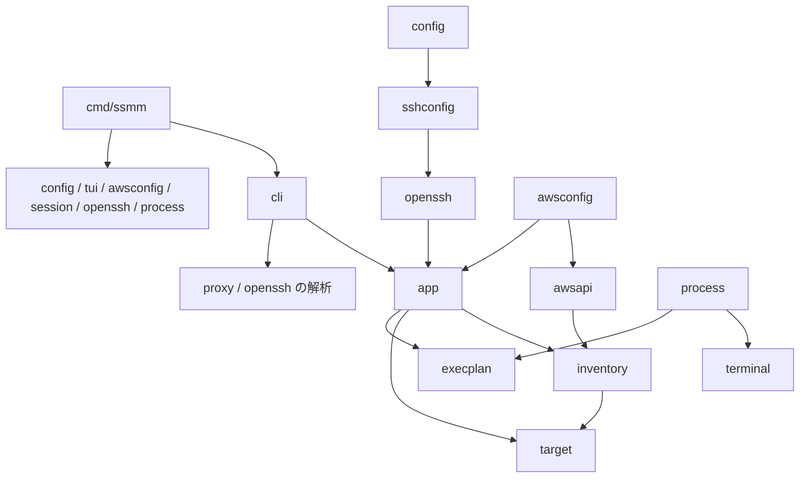
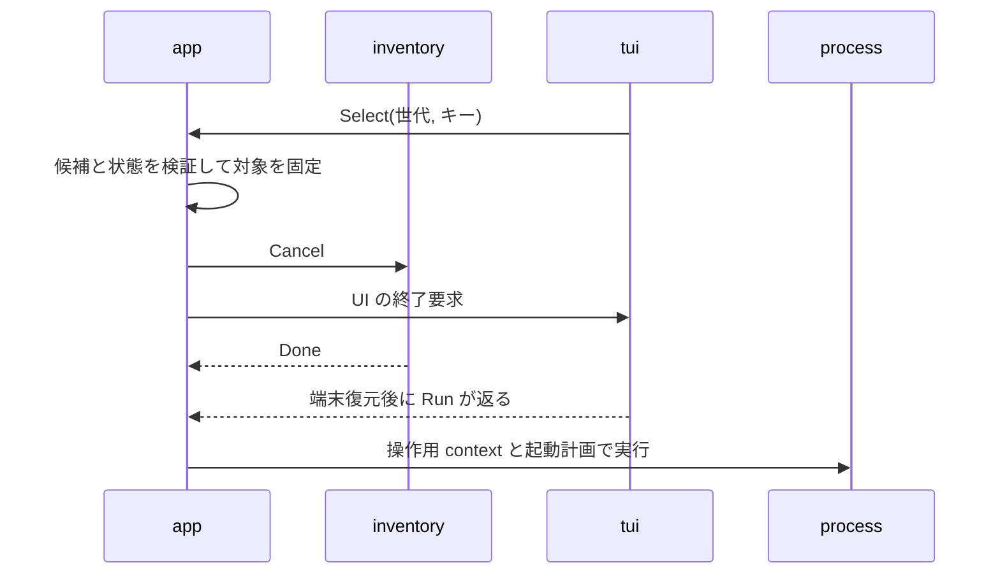

# ssmm コード構造の詳細設計

> [!NOTE]
> 本ドキュメントは実装前の設計記録である。現行の構成は [アーキテクチャ](../architecture.md)、動作仕様は [仕様](../specification.md) を参照。

本ドキュメントは、Go のファイル配置、型とインターフェースの所有先、検索と選択の状態遷移、外部処理の実行契約を定義する。記載するファイルとコードは実装予定であり、実装済みの API ではない。

## 配置と依存

処理手順は app、AWS と OS への接続はアダプター、検索の判定は target に配置する。インターフェースは差し替える外部操作に限り、純粋な判定関数や値型を機械的にインターフェース化しない。

主要ファイルの配置を、以下に示す。同じ行に並ぶファイルは同じパッケージに属する。

| ディレクトリ | ファイル | 内容 |
| --- | --- | --- |
| cmd/ssmm | main.go、wire.go | 実装の組み立て、実行、後処理後の os.Exit |
| internal/cli | root.go、connect.go、list.go、ssh.go、scp.go、proxy.go、init.go | コマンド別の引数変換 |
| internal/cli | output.go、exit.go | 外部向け JSON、table、診断、終了コード |
| internal/app | ports.go、settings.go、errors.go | 外部操作の契約、設定の値型、アプリケーションエラー |
| internal/app | service.go、scope.go、resolve.go、selection.go | 操作の実行、検索範囲、対象解決、選択状態の遷移 |
| internal/app | connect.go、ssh.go、scp.go、proxy.go、init.go | コマンド固有の処理手順 |
| internal/target | profile.go、instance.go、query.go、match.go、sort.go | 対象の値型と純粋な判定 |
| internal/inventory | source.go、snapshot.go、run.go、aggregate.go | 取得契約、1 世代の実行、結果の集約 |
| internal/awsconfig | profile.go、load.go、factory.go | プロファイルの検証、SDK 設定、リージョン別クライアントの構成 |
| internal/awsapi | regions.go、ec2.go、ssm.go、errors.go | API と paginator、取得型とエラーの変換 |
| internal/config | decode.go、paths.go、store.go、commit_unix.go | TOML、パス、初期設定の複数ファイル保存 |
| internal/tui | select.go、model.go、init.go | Bubble Tea のイベント変換と表示 |
| internal/session | plan.go | AWS CLI の起動計画 |
| internal/openssh | parse.go、plan.go、quote.go | scp の構文解析、ssh・scp の起動計画、ProxyCommand |
| internal/proxy | parse.go、internal.go | 標準ホスト名と内部引数の解析 |
| internal/sshconfig | render.go、include.go | SSH 設定と既存設定に加える Include のバイト列 |
| internal/execplan | spec.go、result.go | 起動計画と終了結果の値型 |
| internal/terminal | tty_unix.go | /dev/tty、端末属性、フォアグラウンドグループ |
| internal/process | runner_unix.go、signals_unix.go | 起動、待機、シグナル、終了後の回収 |

app が import する内部パッケージは target、inventory、execplan に限定する。config、tui、session、openssh は app のインターフェースを実装する。awsconfig は app の AWS 接続契約を実装し、awsapi は inventory の取得契約を実装する。process は app の実行インターフェースを構造的に満たすが、execplan と terminal だけを参照すればよい。

config は sshconfig を使って生成し、sshconfig は openssh のエンコーダーを利用できる。逆方向の依存は設けない。proxy と openssh の構文解析を cli が呼び出し、app には解析済み入力を渡す。app がコマンドライン文字列を再解析する構成にはしない。

依存の具体的な向きを、以下に示す。



## 型の所有先

境界で交換する型は、処理の意味を定義するパッケージに置く。AWS SDK、Cobra、Bubble Tea の型は app、target、inventory、execplan に公開しない。

型と変更権限を、以下にまとめる。

| パッケージ | 型 | 変更権限と制約 |
| --- | --- | --- |
| target | ProfileSelection、ProfileSource | 認証の値を持たず、名前と flag・host・env・default の指定元を持つ |
| target | InstanceKey、Instance、TargetQuery、ResolvedTarget | 検索条件と解決結果。解決後に Name を再利用しない |
| inventory | SearchScope、RegionProgress、InventorySnapshot | 集約処理が内部状態を変更し、外へコピーを発行する |
| inventory | SSMRecord、FetchError | API に依存しない SSM 情報と取得エラー |
| app | SettingsSnapshot、EffectiveSettings、SSHOptions | 保存値、適用値、設定元を分ける |
| app | SelectionView、SelectionAction、SelectionMode | 画面に表示する状態と入力。app が遷移を決定する |
| app | SessionRequest、SSHRequest、SCPRequest | 解決済み対象と操作別の入力 |
| app | SettingsDraft、SettingsUpdate、SaveReport | 保存前の比較情報、保存予定値、ファイル別の保存結果 |
| execplan | ProcessSpec、Streams、ProcessResult | 実行計画、実際のファイル記述子、終了結果を分ける |
| cli | ListRow | 公開 JSON のフィールドと null の規則を固定する |

ProfileSelection の default は ssmm の設定参照名であり、SDK に default プロファイルを明示指定する指示ではない。名前が同じでも指定元が異なる場合は、認証経路の等価性を仮定しない。

TargetQuery は Name・ID・タグ条件を保持する。--filter は取得条件に含めず、app が候補を判定するときの初期フィルタとして保持する。これにより、対話中にフィルタを消しても取得済みの行を失わない。

InstanceKey は検索操作内でのリージョンと ID の組である。操作内ではプロファイルが 1 つに固定される。複数アカウントの一覧を将来まとめる場合は、キーにアカウントの識別を追加する設計が必要になる。

Go の map と slice は値の代入だけでは内容を分離できない。ページから集約状態へ入れるときと、集約状態からスナップショットを公開するときに、タグを含めてコピーする。公開したスナップショットの内容を後から書き換えてはいけない。

## アプリケーションの境界

Service は必要な外部操作をコンストラクターで受け取る。全コマンドに 1 つの巨大なバックエンドを渡さず、外部状態を持つ操作ごとに契約を分ける。

主要な契約のシグネチャを、以下に示す。型のフィールドは前節と操作別の節で定義する。

```go
type SettingsStore interface {
    Read(context.Context) (SettingsSnapshot, error)
    ReadForUpdate(context.Context) (SettingsDraft, error)
    Commit(context.Context, SettingsUpdate) (SaveReport, error)
}

type ProfileChecker interface {
    Validate(context.Context, target.ProfileSelection) error
}

type AWSFactory interface {
    Open(context.Context, target.ProfileSelection) (AWSRuntime, error)
}

type AWSRuntime interface {
    inventory.Source
    EnabledRegions(context.Context, string) ([]string, error)
}

type SelectionUI interface {
    Run(context.Context, <-chan SelectionView, chan<- SelectionAction) error
}

type InitUI interface {
    Edit(context.Context, SettingsDraft) (SettingsUpdate, error)
}

type SessionPlanner interface {
    PlanSession(SessionRequest) (execplan.ProcessSpec, error)
}

type SSHPlanner interface {
    PlanSSH(SSHRequest) (execplan.ProcessSpec, error)
    PlanSCP(SCPRequest) (execplan.ProcessSpec, error)
}

type Runner interface {
    Run(context.Context, execplan.ProcessSpec, execplan.Streams) (execplan.ProcessResult, error)
}
```

SettingsStore は ssmm の設定と SSH 連携の保存対象を扱う。AWS の共有設定は ProfileChecker と AWSFactory が扱う。ProfileChecker は SDK の共有設定読み取りを使用し、プロファイルの存在検証だけで EC2 や SSM を呼び出さない。

通常の Read は TOML だけを読む。ReadForUpdate は init 用に SSH 設定も読み、比較用の状態を SettingsDraft に含める。list と通常の名前解決が ~/.ssh/config の読み取り可否に依存してはいけない。InitUI のキャンセルでは Commit を呼ばない。

AWSRuntime は 1 操作のプロファイルに束縛する。リージョンの呼び出しごとに共有設定や環境変数を読み直さず、同じ SDK 設定と認証情報キャッシュからクライアントを作る。取得の失敗時に ProfileSelection を変更するフォールバックは設けない。

SessionPlanner と SSHPlanner は外部プロセスを起動しない。実行ファイルの絶対パスは、操作に必要な依存を確認した後にコンストラクターへ渡す。list には AWS CLI、plugin、OpenSSH の存在確認を要求しない。起動計画の値は生成後に変更しない。

cli はコマンドを Request へ変換し、app の操作を呼び出す。-p だけを共通の persistent flag とし、他のフラグは適用先のコマンドに登録する。root と connect は同じ接続操作を使う。Cobra のエラー自動表示は抑制し、診断と使用法を cli から一度だけ表示する。

操作端末の取得は選択の開始前に行い、その成否を Request の対話可否へ反映する。取得済みの端末を tui に注入し、選択中に開き直さない。proxy と --non-interactive の対象選択では端末を取得しない。接続用の端末は Runner が別途管理する。

## 検索イベントの契約

inventory はページネーションの構造を知る必要がなく、awsapi は並行数や TUI を知る必要がない。ページ単位の callback を境界として、SDK の全件取得を待たずに行を表示する。

inventory.Source の契約を、以下に示す。

```go
type Source interface {
    EC2(context.Context, string, target.TargetQuery, func([]target.Instance) error) error
    SSM(context.Context, string, func([]SSMRecord) error) error
}
```

Source は 1 回の呼び出し内では callback を直列に呼ぶ。nil の返却は最終ページまで取得したことを表す。callback が返したエラーは呼び出し元へ返し、以後のページを要求しない。呼び出しから戻った後に callback を実行してはいけない。

awsapi は空ページと継続トークンを別に扱い、トークンの循環を FetchError とする。30 秒の期限は各ページの要求とその SDK 再試行全体に適用する。認証情報取得が API リクエスト中に発生する場合も、この context を渡す。再試行は SDK の最大 3 試行に限定する。

inventory の内部イベントと処理を、以下に示す。

| イベント | 内容 | 集約処理 |
| --- | --- | --- |
| EC2Page | 世代、リージョン、ページ番号、行 | キーごとに追加・更新する |
| EC2Done | 世代、リージョン、成功または取得エラー | EC2 の終端状態を確定する |
| SSMPage | 世代、リージョン、ページ番号、SSM 情報 | リージョン単位の一時領域へ蓄積する |
| SSMDone | 世代、リージョン、成功・失敗・省略理由 | 成功時だけ SSM 情報を確定し、欠落行を NotReported にする |

同じワーカーのページと終端イベントは送信順を保持する。イベントキューは有界とし、送信待ちでは context のキャンセルを監視する。キューが満杯の場合は取得を一時停止し、ページを破棄してはいけない。UI はこのキューを消費せず、集約処理が独立して読み続ける。

SSM のページは取得完了まで公開行へ適用しない。途中失敗で一部だけ Online が残る状態を避け、取得中と失敗時の行は Unknown とする。EC2 に対応しない SSM 行からインスタンスを追加してはいけない。

EC2 完全性と検索終了は、以下の条件で定義する。

```text
EC2Complete = scope 内の全リージョンの EC2 状態が Succeeded
Finished = scope 内の全リージョンで EC2 と SSM が終端状態
```

通常の検索で scope が空なら設定または列挙エラーとし、空集合に対する全称判定で成功にしない。EC2 の省略による完全性は認めない。直接指定 proxy は inventory を作らず、この判定の対象外とする。

公開スナップショットは世代内で単調増加する Revision を持つ。通知チャネルの容量は 1 とし、集約処理だけが発行する。未読の通知があれば最新の完全なスナップショットへ置き換えられる。Finished の通知を残してからチャネルを閉じる。受け取り側は閉じる前の通知を消費し、最終状態の確認後に完了を判定する。

Cancel は停止要求だけを送る。Done はワーカー、イベントキューの排出、集約処理の終了がすべて完了してから閉じる。集約処理はキャンセル後もワーカーの終了まで動作し、未完了リージョンを Canceled に確定する。Cancel したことと Done が閉じたことを同一視してはいけない。

## 選択と更新の状態遷移

app の選択コントローラーは、スナップショットと UI 入力を 1 つのループで処理する。tui は選択キーを通知するだけで、ResolvedTarget を直接生成しない。

選択モードを、以下に示す。

| モード | 開始条件 | 完了条件 |
| --- | --- | --- |
| Explicit | 対象省略で操作端末あり | 現世代の行に対する Enter |
| AutoWhenComplete | Name または ID の指定 | Finished かつ EC2Complete かつ候補 1 件、または有効な Enter |
| ManualOnly | 対話でのフィルタ編集、複数候補確定、不完全な検索終了 | 現世代の行に対する Enter |
| NonInteractive | 端末なし、--non-interactive、proxy | Finished かつ EC2Complete かつ候補 1 件 |

候補を数えた後に running を検査する。停止中の行を先に除外すると、重複した Name を 1 件と誤判定するためである。SSM 状態は一意性と選択可否の条件に加えない。

SelectionAction は FilterChanged、Select、Refresh、Cancel を区別する。Select には画面の Generation と InstanceKey を含める。app は現世代、現在の候補への所属、running を再検証する。SSM 情報だけの更新では選択を拒否せず、古い世代や消えた行からの選択は拒否する。

フィルタは app が保持し、SelectionView に反映する。tui が独立した候補集合を持って app と異なる一意性を判定してはいけない。フィルタ編集後の ManualOnly は、文字列を元に戻しても AutoWhenComplete に戻さない。

更新の手順を、以下に示す。

1. Refresh を受理した時点で世代を進め、旧行の選択を無効にする。
2. 旧世代を Cancel し、Done を待つ間も UI 入力を処理する。
3. 連続した Refresh は 1 件の再取得要求へまとめる。
4. 旧世代の Done 後に、同じ SearchScope と TargetQuery で新世代を開始する。
5. 新世代で取得したキーだけ選択可能にし、保持した選択キーがあれば復元する。

選択完了時は、入力の検証と ResolvedTarget の作成を同じループで行ってから検索をキャンセルする。選択時の有効性を保持し、キャンセルにより残りの EC2 取得が Canceled になったことを理由に、確定済みの手動選択を取り消さない。

接続開始までの処理順序を、以下に示す。



検索用 context、UI 用 context、接続用 context は操作全体の context から個別に派生させる。検索または UI の正常終了を、操作全体のキャンセルとして扱ってはいけない。

## 接続計画と内部 proxy

起動計画は外部コマンドへ渡す値を固定し、process だけが OS の状態を変更する。計画の検証と実行を分けることで、AWS や端末なしで argv を検証できる。

ProcessSpec の主要フィールドを、以下に示す。

| フィールド | 内容 |
| --- | --- |
| Executable | 確認済みの絶対パス |
| Args | argv[0] を含まない引数配列 |
| EnvironmentPolicy | AWS CLI のページャー・自動プロンプトの無効化など、秘密値を含まない変更指示 |
| Mode | Foreground または ProxyStream |

Streams は stdin、stdout、stderr のファイルを持ち、Runner に実行時に渡す。proxy では *os.File をそのまま子へ接続し、io.Copy による先読みやテキスト変換を追加しない。実際の子プロセス環境は起動時に正規化した環境から構成し、計画や診断にはアクセスキーを格納しない。

ラッパーから渡す内部引数の意味を、以下に示す。

| 引数 | 検証 |
| --- | --- |
| proxy ID | ID 形式であること |
| --region REGION | 非空で、初版の対応パーティションのリージョン形式であること |
| --port PORT | 1 から 65535 |
| --profile NAME | 親が選択したプロファイル名 |
| --internal-profile-source SOURCE | flag・host・env・default のいずれか |

内部オプションがある場合は、全項目を必要とする。env なら継承した AWS_PROFILE と名前が一致し、default なら名前が default で AWS_PROFILE が未選択であることを確認する。SOURCE が flag または host の場合だけ AWS CLI に --profile を付ける。内部オプションは認証や入力検証を省略する権限として扱わない。

内部 proxy は ssmm の TOML を再読込しない。AWS の共有設定は CLI 自身が認証に使用するため、こちらの再読込を禁止する仕様にはしない。直接指定 proxy は ProfileChecker によるローカル検証後、AWSFactory と inventory を経由せずに SessionPlanner と Runner を呼ぶ。

ProxyCommand の固定引数は、% の二重化後に POSIX シェル用の単一引用符で囲む。引数内の単一引用符は引用を閉じてエスケープし、引用を開き直す。標準ホスト名経路の %h と %p は固定文字列と区別したトークン型から生成する。任意の文字列中に見つけた %h を展開対象として残してはいけない。

鍵は -o IdentityFile=... で渡し、SSH 設定の引数構文に合わせてパスをクォートする。-i に % を二重化した値を渡すと、トークン展開前の存在確認で別のパスを参照するため、この経路は使わない。ssmm 内で解決した実際のパスと、OpenSSH に渡すエンコード済みの値を別に保持する。

標準 SSH 設定は HostName %h と CanonicalizeHostname no を併記し、後続の Host * による HostName の変更を防ぐ。通常の ssh 設定やコマンドラインで ProxyCommand・HostName を明示的に変更した場合まで同じ動作を保証しない。実際のトークン展開とシェル解釈は、[OpenSSH の接続実装](https://github.com/openssh/openssh-portable/blob/V_9_6_P1/sshconnect.c) を検証対象とする。

## scp の入力と出力

scp の解析結果は転送方向、ローカルパス群、リモートパス群、対象表記、SSH ユーザーを保持する。対象解決は計画全体で 1 回だけ行う。

対応する構文はローカルパスと [USER@]TARGET:PATH に限定する。scp:// URI、IPv6 の角括弧表記、空の TARGET、空の PATH は初版では引数エラーとする。絶対パス・./・../ で始まる入力はコロンを含んでもローカルに分類する。それ以外は最初のコロンで対象とパスを分ける。コロンを含む相対ファイル名は ./ で明示する。

cli は -- 以降をオペランドとして扱う。ローカルパスの先頭ハイフンには ./ を付けて scp に渡す。リモート側は USER@ を別のユーザー設定へ移し、対象部分だけを ID へ置き換える。PATH はそのまま 1 つの argv 要素へ含め、シェル用の引用符を付加しない。

SFTP を既定とする OpenSSH 9.0 以降を必要条件とし、検証済みのリリースは別途固定する。-O は提供しない。リモートパスのワイルドカードや ~/ の意味は scp と接続先の SFTP 実装に従い、任意のパスが文字どおりのファイル名として扱われる保証は設けない。仕様の詳細は、[scp のマニュアル](https://man.openbsd.org/scp.1) を参照。

## プロセスと保存の後処理

後処理の完了は操作の完了条件に含める。OS の処理は Unix 用の実装へ分離し、Linux と macOS の差異を app に公開しない。

### プロセスの寿命

Foreground は操作端末がある場合だけ子のグループへ端末を移す。子が端末を読む前に移譲を完了し、Start 後の後追いの切り替えによる SIGTTIN を避ける。Go の SysProcAttr.Foreground と Ctty の意味は OS ごとに検証する。仕様の詳細は、[Go の SysProcAttr](https://pkg.go.dev/syscall#SysProcAttr) を参照。

ProxyStream は操作端末を開かず、AWS CLI を専用のプロセスグループで起動する。SIGHUP、SIGTERM、SIGINT を子のグループへ転送し、初期値 2 秒の猶予後に残存する同グループのプロセスを終了させる。外側の Foreground の終了猶予は初期値 5 秒とし、内部 proxy の後処理を待てるようにする。期限はプロセス終了の検証結果に応じて調整する。

終了要求の受付は子の Start 前に準備し、Start と終了要求の競合を同じ状態機械で処理する。Start 前にキャンセルを受理した場合は起動しない。Start 後なら PID とグループを記録してからシグナルを送る。直接の子に対する Wait は 1 回だけ行う。

子の通常終了時も残存する子プロセス群の後処理を行い、端末属性とフォアグラウンドを復元してから返る。端末の復元失敗は黙って無視せず、終了結果に付随する診断として返す。プロセスに紐づくシグナル通知は停止し、次の操作へ漏らさない。

ProcessResult は開始済みの子の終了コードまたは終了シグナルを保持する。error は起動失敗や実行管理の失敗を表す。子が非ゼロで終了しただけの場合を起動失敗へ変換しない。proxy が SIGHUP で終了要求を受けた場合も、後処理後にシグナルに対応する終了を報告する。

### 初期設定の保存

SettingsDraft は TOML の解釈結果に加え、更新対象 3 ファイルの元のバイト列、存在状態、モード、シンボリックリンクの解決先を保持する。ファイルが存在しなかった状態と空ファイルを区別する。SettingsUpdate は編集結果とこの比較用の状態を持つ。

Commit は専用のロックファイルを取得し、現在の各ファイルと比較用の状態を照合する。不一致なら一切の rename を行わず競合を返す。検証と全ファイルの生成を終えてから一時ファイルを作り、ファイルを同期して同じディレクトリで rename する。必要なディレクトリ同期も OS の実装に閉じ込める。

config.toml、管理用 SSH 設定、~/.ssh/config の順に更新する。SaveReport は各パスについて未変更、保存済み、未保存を返す。途中失敗後に保存済みファイルを盲目的に元へ戻さず、保存結果と再実行方法を表示する。ロックを解放するまで一時ファイルの後処理も完了させる。

## 実装の確認点

設計の契約は、境界を差し替えて観測できる動作で検証する。構造の検査と実際の AWS・端末の互換性を区別する。

対応する実装上の確認点を、以下に示す。

| 境界 | 確認点 |
| --- | --- |
| パッケージ | app にアダプターや外部 SDK の import がない |
| 取得 | 後続ページの失敗・トークン反復で完全性が false となる |
| 通知 | 遅い UI、キャンセル、終了時でもページを失わず Done に到達する |
| 選択 | フィルタ編集で自動接続せず、旧世代の Enter を拒否する |
| 内部 proxy | ssmm 設定の再読込と検索 API が発生しない |
| 起動計画 | シェルで解釈する値は ProxyCommand だけである |
| 終了 | SIGHUP と SIGTERM 後に AWS CLI・plugin を模した子が残存しない |
| 保存 | 競合時は全ファイルが未変更で、途中失敗時は保存状態を識別できる |

実装順序と実 AWS を使う検証の詳細は、[IMPLEMENTATION.md](IMPLEMENTATION.md) を参照。設計レビューで確認した根拠と未検証事項の詳細は、[DESIGN_REVIEW.md](DESIGN_REVIEW.md) を参照。
