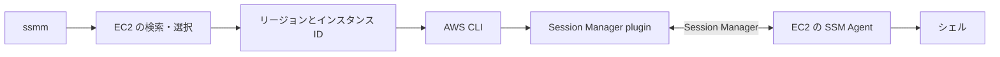
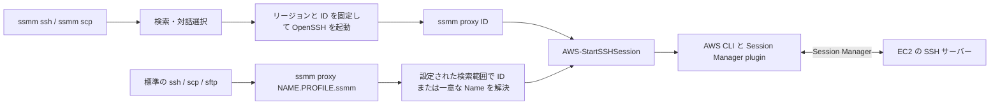

# ssmm 設計案

> [!NOTE]
> 本ドキュメントは実装前の設計記録である。現行の動作仕様は [仕様](../specification.md)、操作方法は [利用ガイド](../../usage/README.md) を参照。

本ドキュメントは、EC2 インスタンスの検索と Session Manager による接続を簡略化する Go 製 CLI ツール ssmm の設計案である。指定した AWS プロファイルでリージョンを横断して対象を検索し、シェル接続と既存の SSH ツールを使ったファイル転送を行う。記載するコマンドは実装予定の仕様である。

## 基本構成

Go でインスタンスの取得、検索、対話選択を実装し、接続は AWS CLI と Session Manager plugin に委譲する。SSH 接続とファイル転送には、ssmm から OpenSSH を直接起動する方式と、標準の SSH ツールから ProxyCommand で ssmm を呼び出す方式の両方を提供する。

機能と実装の対応を、以下に示す。

| 機能 | 実装 |
| --- | --- |
| サブコマンドとフラグ | Cobra |
| AWS 設定とインスタンス情報の取得 | AWS SDK for Go v2 |
| 対話的な一覧とフィルタ入力 | Bubble Tea |
| Session Manager のシェル接続 | aws ssm start-session と Session Manager plugin |
| 対象の選択から SSH 接続までの実行 | ssmm ssh から OpenSSH の ssh を起動 |
| 対象の選択からファイル転送までの実行 | ssmm scp から OpenSSH の scp を起動 |
| 標準の SSH ツールとの連携 | ssmm proxy を ProxyCommand として使用 |

ssmm ssh と ssmm scp は、Name が重複している場合に対象を選択してから実行する。標準の ssh、scp、sftp から呼ばれる ssmm proxy は、インスタンス ID または一意な Name で接続する。対象の検索処理と Session Manager の接続処理は共通化する。

通常のシェル接続には SSH サーバーと SSH 鍵は不要である。SSH 経由のファイル転送には、接続先の SSH サーバーと SSH 認証が別途必要である。Session Manager を通信経路とするため、SSH 用のインバウンドポート開放や踏み台は不要である。接続条件の詳細は、[AWS の SSH 接続設定](https://docs.aws.amazon.com/systems-manager/latest/userguide/session-manager-getting-started-enable-ssh-connections.html)を参照。

## CLI と対話操作

CLI は、Session Manager のシェル接続、一覧出力、SSH 接続、ファイル転送、ProxyCommand 用の接続を提供する。名称は ssmm を仮称とする。

### 日常のコマンド

プロファイルを実行時に指定し、対象を Name またはインスタンス ID で指定する。ssmm プロファイルに検索対象のリージョンを保存できる。指定がなければ、その AWS プロファイルの接続先アカウントで有効な全リージョンを検索する。日常のコマンドを、以下に示す。

| コマンド | 動作 |
| --- | --- |
| ssmm -p PROFILE | リージョンを横断した一覧から接続先を選び、Session Manager のシェルを開く |
| ssmm -p PROFILE TARGET | Name または ID で検索して Session Manager のシェルを開く |
| ssmm list -p PROFILE | リージョンを横断したインスタンス一覧を出力して終了する |
| ssmm ssh -p PROFILE [TARGET] | 接続先を選択して OpenSSH の ssh を起動する |
| ssmm scp -p PROFILE SRC... DEST | リモート側の Name または ID を解決して OpenSSH の scp を起動する |

prod プロファイルを使う操作例を、以下に示す。

```sh
ssmm -p prod
ssmm -p prod web-api
ssmm ssh -p prod web-api
ssmm scp -p prod ./config.yaml web-api:/tmp/
ssmm scp -p prod web-api:/tmp/result.txt ./
```

TARGET は Name またはインスタンス ID とする。ID 形式に一致する文字列は ID として扱い、それ以外は Name として完全一致で検索する。ID の文字列だけではリージョンを決定できないため、ID 指定でもリージョンを横断して所在を検索する。

ssh と scp では USER@TARGET による SSH ユーザーの指定もできる。scp の対象指定の区切り文字を含む Name は、インスタンス ID で指定する。

### ssmm プロファイル

ssmm プロファイルは、AWS プロファイルと同名で登録する ssmm 固有の設定である。検索対象のリージョンと SSH の既定値を保存する。-p prod は、AWS プロファイル prod で認証し、ssmm の profiles.prod を読み込む。対応する ssmm プロファイルがなければ、有効な全リージョンを検索する。

ssmm init は、リージョンの限定と SSH の設定を対話的に追加・更新する。リージョンは複数選択でき、全リージョンを使う場合は regions を保存しない。初期設定を行う例を、以下に示す。

```sh
ssmm init -p prod
```

ssmm プロファイルは ~/.config/ssmm/config.toml に保存する。prod の検索を 2 リージョンに限定し、dev では有効な全リージョンを検索する例を、以下に示す。

```toml
[profiles.prod]
regions = ["ap-northeast-1", "us-west-2"]

[profiles.prod.ssh]
user = "ec2-user"
identity_file = "~/.ssh/prod.pem"

[profiles.dev.ssh]
user = "ubuntu"
```

regions は検索対象のリージョン名の配列であり、一覧、Name・ID の解決、SSH 接続、ファイル転送、proxy のすべてに適用する。1 件の指定で単一リージョンに限定できる。Name の一意性と検索の完了は、この検索範囲内で判定する。範囲外のリージョンは未取得エラーとして数えない。

regions の省略は有効な全リージョンの検索を意味する。空配列、空文字列、存在しないリージョン、未有効化リージョンの指定は設定エラーとする。重複したリージョン名は 1 件にまとめる。設定が不正な場合は検索範囲を広げず、エラーを表示して終了する。

--region の明示指定は ssmm プロファイルの regions をその操作だけ上書きする。上書き後の検索範囲は一覧のヘッダーと診断出力に表示する。プロファイルの内容は変更しない。

認証情報そのものは保存せず、identity_file は既存の SSH 鍵のパスを指す。ssh.port の省略時は 22 とする。ssh.integration は標準 SSH 連携の有効・無効を保持する真偽値であり、省略時は false とする。検索対象のリージョンは ssmm の regions で管理し、AWS プロファイルの region は列挙 API の呼び出し先として扱う。

標準の SSH ツールとの連携を選択した場合、ssmm init はプロファイルごとの User、IdentityFile、Port、ProxyCommand を管理用の SSH 設定に書き出し、~/.ssh/config の先頭に独立した Include 行を登録する。更新時もこの管理用ファイルを再生成する。既存の SSH 設定は保持し、Include の重複登録を防ぐ。通常の接続や転送に設定生成の操作は不要である。

同じプロファイル内で SSH ユーザーが異なる場合は USER@ または --user で上書きする。保存していない SSH 設定も明示オプションで指定できる。

### 補助コマンドと個別の上書き

補助コマンドを、以下に示す。

| コマンド | 動作 |
| --- | --- |
| ssmm init -p PROFILE | 検索対象リージョン、SSH の既定値、標準 SSH ツールとの連携を設定する |
| ssmm connect [TARGET] | ssmm [TARGET] の明示的な形式。Name がサブコマンド名と同じ場合にも使用 |
| ssmm proxy TARGET | ID または一意な Name への SSH 通信を標準入力・標準出力で中継する |

保存済みの設定はオプションでその操作だけ上書きできる。オプションを、以下にまとめる。

| オプション | 適用先 | 意味 |
| --- | --- | --- |
| --profile, -p | 全コマンド | 実行する AWS プロファイル |
| --region | 接続・一覧コマンド | 検索範囲をその操作だけ 1 リージョンに上書きする。通常は省略 |
| --filter | ssmm、connect、list、ssh | 部分一致フィルタ。対話一覧では入力の初期値 |
| --tag KEY=VALUE | ssmm、connect、list、ssh | EC2 タグによる絞り込み。複数指定は AND |
| --output table\|json\|id | list | 出力形式。既定値は table |
| --non-interactive | ssmm、connect、ssh、scp | 対話選択を禁止する。proxy は常に対話選択なし |
| --user | ssh、scp | SSH ユーザーの上書き。USER@ による指定の代わりに使用 |
| --identity-file | ssh、scp | ssmm が OpenSSH に渡す SSH 鍵ファイルのパス |
| --port | ssh、scp、proxy | 接続先の SSH ポートの上書き |
| --recursive, -r | scp | ディレクトリを再帰的に転送する |

ID に検索条件を併用した場合はエラーとする。日常のヘルプはプロファイルと対象の指定を中心に説明し、個別の上書きは各サブコマンドのヘルプに記載する。

--identity-file は ssmm に保存された identity_file を上書きする。OpenSSH の設定ファイルや ssh-agent にある他の鍵を排除する指定ではない。IdentityFile は OpenSSH では追加方式の設定であるため、鍵の排他的な指定と区別する。仕様の詳細は、[OpenSSH の IdentityFile](https://man.openbsd.org/ssh_config.5#IdentityFile) を参照。

### 対話一覧

一覧には、プロファイル、適用された検索範囲とその設定元、リージョンごとの取得進捗、Name、リージョン、インスタンス ID、EC2 状態、SSM 状態、プライベート IP、Availability Zone を表示する。Name タグがない場合もインスタンス ID で識別できる。

表示例を、以下に示す。

```text
Profile: prod    Regions: 2 / 2 completed
Scope: ap-northeast-1, us-west-2    Source: profiles.prod.regions
Filter: web

  NAME      REGION           INSTANCE ID          STATE    SSM
> web-api   ap-northeast-1   i-0123456789abcdef0    running  Online
  web-api   us-west-2        i-0123456789abcdef1    running  Online
  web-old   ap-northeast-1   i-0123456789abcdef2    stopped  NotReported

3 / 24 loaded instances    ↑↓: select    Enter: connect    Ctrl+R: refresh    Esc: cancel
```

文字入力でフィルタを更新し、矢印キーで移動し、Enter で選択する。フィルタは大文字と小文字を区別しない部分一致とし、空白で区切った語は AND 条件とする。検索対象は Name、リージョン、インスタンス ID、プライベート IP、Availability Zone、タグのキーと値である。

フィルタは取得済みの情報に適用する。文字入力のたびに AWS API を呼び出さない。取得できた行は順次表示し、Ctrl+R による再取得では、フィルタと選択中のリージョン・インスタンス ID を可能な限り維持する。検索途中でも、表示された具体的な行を手動で選択して接続できる。

既定では terminated を除く EC2 インスタンスを表示する。停止中のインスタンスも表示するが、接続操作は無効にして理由を表示する。対話一覧に明示的に入った場合、候補が 1 件になっても Enter による選択を待つ。

### Name の解決

Name による検索は、EC2 の Name タグとの大文字・小文字を区別する完全一致である。入力した Name に一致するインスタンスがなければエラーとし、部分一致への自動切り替えは行わない。部分一致で探す場合は connect または ssh の --filter を使う。

Name と --tag・--filter を併用した場合は AND 条件とし、その候補集合内で一意性を判定する。対話中のフィルタ編集で候補が 1 件になった場合は Enter を待つ。ID 指定の解決画面ではフィルタ編集を提供しない。

Name 解決の結果を、以下に示す。

| 一致件数 | 動作 |
| --- | --- |
| 0 件 | 対象なしとして終了 |
| 1 件 | 接続または転送を実行 |
| 2 件以上 | 一致したインスタンスを対話一覧に表示 |
| 2 件以上かつ対話不可 | 候補を標準エラー出力に示して終了。インスタンス ID による指定を案内 |

同じ Name が複数ある場合、リージョンの違いや停止中のインスタンスも重複判定に含める。接続可能な 1 件を暗黙に選ぶ動作にはしない。選択後はリージョンとインスタンス ID を保持し、接続直前に Name を再解決しない。

Name の一意性は、検索対象の全リージョンで EC2 の全ページ取得が成功してから判定する。取得途中の 1 件を唯一の候補として接続してはいけない。全件取得前に接続する場合は、対話一覧でリージョンとインスタンス ID が明示された行を選択する。

proxy は常に対話不可として扱う。重複時は候補の ID を表示し、ID による指定または ssmm ssh・ssmm scp による対話選択を案内する。

### 非対話出力

ssmm list は TUI を起動せず、結果を出力して終了する。JSON 出力は配列とし、各要素にインスタンス ID、Name、リージョン、EC2 状態、SSM 状態、プライベート IP、Availability Zone、タグを含める。id 出力は 1 行に 1 つのインスタンス ID を出力する。

他ツール向けに一覧を出力する例を、以下に示す。

```sh
ssmm list -p prod --filter web --output json
ssmm list -p prod --tag Environment=prod --output id
```

構造化出力と proxy の標準出力には、ssmm の進捗表示や診断メッセージを混在させない。これらは標準エラー出力へ送る。

ssh と scp の対象選択には操作端末を使い、端末がない場合は非対話として扱う。標準入力がパイプの場合は操作端末を別に開き、転送・リモート処理に渡すデータを選択入力として消費しない。--non-interactive は ssmm の対象選択を禁止するものであり、OpenSSH 自身の認証やホスト鍵確認の設定とは別である。

connect と ssh で対象を省略した非対話操作は、完全な検索結果の候補が 1 件の場合だけ接続する。0 件、複数件、不完全な結果では非ゼロで終了する。非対話選択の成否と、接続後に外部コマンドが必要とする端末の有無は別に扱う。

## AWS 情報の取得と認証

AWS SDK for Go v2 でアカウントの有効なリージョンを取得し、適用された検索範囲の各リージョンで EC2 の一覧と Systems Manager の管理対象情報を取得する。EC2 情報を基準にして、SSM 情報をリージョンとインスタンス ID で結合する。

### リージョンを横断する検索

EC2 DescribeRegions で、そのアカウントに有効なリージョンを列挙する。regions が未指定の場合は、既定で有効なリージョンとオプトイン済みのリージョンを検索対象にする。regions を指定した場合は、指定した各リージョンが有効であることを確認し、その範囲だけで EC2 と SSM を検索する。有効なリージョンの一覧は接続権限の一覧とは異なり、個々の API 呼び出しの権限エラーは別途処理する。仕様の詳細は、[DescribeRegions](https://docs.aws.amazon.com/AWSEC2/latest/APIReference/API_DescribeRegions.html)を参照。

DescribeRegions 自体の呼び出し先には、--region または regions で検索範囲を明示した場合はその先頭のリージョンを使う。全リージョン検索の場合は AWS の既存設定から得たリージョンを使い、未設定の場合は us-east-1 を使う。列挙 API の呼び出し先だけでインスタンスの検索範囲を決定しない。初版は商用 AWS のパーティション aws を対象とし、AWS GovCloud と中国リージョンのパーティションは別途対応を検討する。

リージョンごとの検索は最大 4 リージョンを並行して処理する案とする。各リージョン内ではページネーションを完了させ、取得結果を共通の一覧へ追加する。TUI のフィルタ入力は AWS API の応答待ちで停止させない。

Name 指定時は EC2 の tag:Name フィルタで候補を取得し、取得後にも Name の完全一致を確認する。API のワイルドカードを含む Name は完全一致の意味を維持できる取得方法を使う。ID 指定時は instance-id フィルタを使い、該当 ID がないリージョンの空結果と API の失敗を区別する。API の詳細は、[DescribeInstances](https://docs.aws.amazon.com/AWSEC2/latest/APIReference/API_DescribeInstances.html)を参照。

選択結果はプロファイル、リージョン、インスタンス ID を含む。接続時は選択結果のリージョンを AWS CLI に渡すため、プロファイルの既定リージョンに依存せず対象へ接続できる。

--region を明示した場合は、そのリージョンだけを検索対象にする。探索を省略するのは proxy に ID と --region を両方渡す場合に限る。この場合は DescribeRegions、EC2、SSM の取得を行わず、対象の存在と接続可否を StartSession で確認する。connect、ssh、scp では同じ指定でも EC2 状態を取得する。ラッパーから proxy を起動する際は、この直接指定経路で再探索を省略する。

### 一覧データ

取得元と用途を、以下に示す。

| API | 用途 |
| --- | --- |
| EC2 DescribeRegions | アカウントで有効なリージョンの列挙 |
| EC2 DescribeInstances | インスタンス ID、Name、タグ、状態、IP、Availability Zone |
| SSM DescribeInstanceInformation | PingStatus、SSM Agent バージョン、OS 情報 |

リージョンごとに EC2 と SSM のページネーションを処理する。EC2 の候補がないリージョンでは SSM 情報の取得を省略できる。SSM 情報だけ取得できない場合は EC2 の一覧を表示し、SSM 状態を Unknown として診断を出す。

DescribeInstanceInformation は停止済みのノードを返さないため、SSM 側に行がないことだけで未管理と断定しない。API を正常に取得できても対応する行がない場合は NotReported とし、取得失敗の Unknown と区別する。API の仕様は、[DescribeInstances](https://docs.aws.amazon.com/AWSEC2/latest/APIReference/API_DescribeInstances.html)と [DescribeInstanceInformation](https://docs.aws.amazon.com/systems-manager/latest/APIReference/API_DescribeInstanceInformation.html)を参照。

Online は SSM Agent の状態であり、接続権限の存在を保証しない。running のインスタンスは接続を試行できるものとし、Online 以外の状態ではその状態を明示する。接続結果は StartSession の成否で判断する。

初版は起動時と明示的な更新時に情報を取得する。永続キャッシュは導入しない。Name、リージョン、インスタンス ID の順に安定して並べ、AWS API の返却順に依存しない。タグ内の制御文字は表示時にエスケープする。

### 一部のリージョンの取得失敗

DescribeRegions が失敗した場合は有効なリージョンを確認できないため、一覧取得を失敗とする。検索対象のリージョンの EC2 取得が失敗した場合は、リージョン名と原因を表示し、検索結果が不完全であることを示す。

対話一覧では、取得済みの行から具体的なインスタンスを選択できる。Name が 1 件だけ見えていても自動接続しない。proxy とその他の非対話の名前解決は、一意性を確定できない場合に非ゼロで終了する。

ssmm list は EC2 の検索結果が完全な場合だけ標準出力に結果を出す。一部のリージョンで取得に失敗した場合は、標準エラー出力に失敗したリージョンを示し、非ゼロで終了する。SSM の状態取得だけの失敗は EC2 の検索結果の不完全さとは区別する。

### 設定値と認証

設定の優先順位を、以下に示す。

| 設定 | 優先順位 |
| --- | --- |
| プロファイル選択 | --profile / -p → AWS_PROFILE → default |
| 検索対象のリージョン | --region → profiles.PROFILE.regions → 有効な全リージョン |
| 列挙 API の呼び出し先 | --region または regions の先頭 → AWS_REGION → AWS_DEFAULT_REGION → AWS プロファイルの region → us-east-1 |
| 接続先のリージョン | 選択したインスタンスの検索結果 |
| SSH ユーザー | USER@ または --user → profiles.PROFILE.ssh.user |
| ssmm が渡す SSH 鍵ファイル | --identity-file → profiles.PROFILE.ssh.identity_file → 明示指定なし。OpenSSH の他の鍵設定は併存する |
| SSH ポート | --port → profiles.PROFILE.ssh.port → 22 |

AWS プロファイル、検索範囲、SSH 設定は処理開始時に解決して保持する。SSH ユーザーが必要な操作で設定を解決できない場合は、初期設定または上書き指定を案内する。

標準 SSH ホスト名から得たプロファイルは明示指定として扱い、AWS_PROFILE より優先する。-p と併用した場合は両者の一致を必要とする。AWS_DEFAULT_PROFILE はプロファイル選択に使わず、SDK と AWS CLI から同じように除外する。

認証情報の取得は SDK の標準設定に委譲する。独自の認証情報ファイルを作らず、共有設定、SSO、AssumeRole、credential_process、環境変数による認証を扱う。プロファイル選択と認証情報の優先順位は別の処理である。設定の詳細は、[AWS SDK for Go v2 の設定](https://docs.aws.amazon.com/sdk-for-go/v2/developer-guide/configure-gosdk.html)を参照。

初版は実行中に MFA コードを要求する直接の AssumeRole に対応しない。事前認証済みの短期認証情報、SSO、追加入力なしで認証情報を返す credential_process など、SDK と CLI の両方が入力なしで解決できる認証経路を必要とする。

接続用の AWS CLI には、選択したインスタンスのリージョンと、同じプロファイル指定・認証環境を引き継ぐ。フラグで明示されたプロファイルと、環境変数から選ばれたプロファイルの区別を保持する。SDK と CLI の認証経路が一致することを、対応する認証方式ごとに確認する。

リージョンの設定を持たないプロファイルでも、列挙用の呼び出し先を決定して横断検索する。SSO のログインが必要な場合は、対象プロファイルの aws sso login コマンドを案内する。

## Session Manager 接続

ssmm はリージョンとインスタンス ID を確定してから TUI を終了し、端末の状態を復元して AWS CLI を起動する。接続経路を、以下に示す。



通常の接続で起動するコマンド例を、以下に示す。

```sh
aws --profile prod --region ap-northeast-1 ssm start-session \
  --target i-0123456789abcdef0
```

子プロセスは Go の os/exec で引数配列を渡して起動し、標準入力、標準出力、標準エラー出力を引き継ぐ。シェル用のコマンド文字列の組み立ては行わない。対話中の Ctrl+C、端末サイズ変更、終了時の端末復元、子プロセスの終了コードを扱う。

初版の接続には、AWS CLI v2 と Session Manager plugin を外部依存とする。AWS CLI は StartSession の応答を plugin に渡し、plugin がセッションの通信を処理する。利用条件と実装の詳細は、[AWS CLI によるセッション開始](https://docs.aws.amazon.com/systems-manager/latest/userguide/session-manager-working-with-sessions-start.html#sessions-start-cli) と [AWS CLI v2 の Session Manager 実装](https://github.com/aws/aws-cli/blob/v2/awscli/customizations/sessionmanager.py) を参照。

AWS CLI への依存を減らす場合は、SDK による StartSession と plugin の直接起動へ置き換えられる。ただし、plugin の起動引数、セッショントークンの受け渡し、対応バージョン、異常終了時の TerminateSession の処理を ssmm が管理する必要がある。この置き換えは後続の設計対象とする。

## SSH 接続とファイル転送

ssmm から OpenSSH を起動する方式と、標準の SSH ツールから ssmm を呼び出す方式を提供する。どちらも AWS-StartSSHSession により、EC2 の SSH サーバーへ通信する。

### ssmm からの実行

ssmm ssh と ssmm scp は、対象の選択と OpenSSH の起動を 1 コマンドで実行する。Name が重複していれば一覧を表示し、選択後に SSH 接続または転送を開始する。

SSH 接続、ファイル送信、ファイル受信の例を、以下に示す。

```sh
ssmm ssh -p prod web-api
ssmm scp -p prod ./config.yaml web-api:/tmp/
ssmm scp -p prod web-api:/tmp/result.txt ./
```

ssmm ssh は対象の省略時にリージョンを横断した一覧を表示する。SSH ユーザーはプロファイルごとの SSH 設定から取得し、USER@ または --user で上書きできる。USER@ と --user の指定が異なる場合はエラーとし、AMI からユーザー名を推測しない。

ssmm scp のリモート指定は [USER@]TARGET:PATH とする。初版の転送はローカルと 1 台の EC2 の間を対象とし、リモート間転送は対象外とする。複数のローカルファイルを 1 つのリモートディレクトリへ送信できる。コロンを含むローカルパスは絶対パス、./ または ../ で始まるパスとし、リモート指定と区別する。scp:// URI、IPv6 の角括弧表記、空の TARGET・PATH は受け付けない。

ssmm は OpenSSH の起動前に対象をインスタンス ID へ解決し、リモート指定の対象部分だけをその ID に置き換える。ファイルパスは名前解決の対象にしない。インスタンス ID とプロファイル、リージョン、ポートを固定した ProxyCommand を OpenSSH の -o オプションで渡す。設定ファイルを生成する操作は不要である。

ssmm ssh と ssmm scp は、内部で ssmm proxy ID を呼び出し、解決済みのプロファイル・リージョンも明示的に渡す。同じ実行中に Name を再解決しないため、scp が内部で SSH プロセスを起動しても対象の選択やリージョンの探索を繰り返さない。

### 標準の SSH ツールからの実行

標準の ssh、scp、sftp では、ssmm init でプロファイルごとの SSH 設定を用意する。ユーザー名と鍵は OpenSSH がこの設定から取得し、接続先は proxy が実行時にリージョンを横断して解決する。

prod プロファイル向けに生成する SSH 設定の例を、以下に示す。

```sshconfig
Host *.prod.ssmm
    HostName %h
    CanonicalizeHostname no
    User ec2-user
    IdentityFile /home/example/.ssh/prod.pem
    Port 22
    ProxyCommand '/usr/local/bin/ssmm' proxy '%h' --port '%p'
    ControlPath none
```

実行ファイルと鍵のパスには、設定生成時に解決した絶対パスを使う。例の実行ファイル配置は /usr/local/bin/ssmm である。HostName と CanonicalizeHostname は、後続の汎用設定による接続先名の書き換えを防ぐために生成する。

標準コマンドによる接続、送信、受信、対話的なファイル操作の例を、以下に示す。

```sh
ssh web-api.prod.ssmm
scp ./config.yaml web-api.prod.ssmm:/tmp/
scp web-api.prod.ssmm:/tmp/result.txt ./
sftp web-api.prod.ssmm
```

proxy は TARGET に NAME.PROFILE.ssmm または ID.PROFILE.ssmm を受け取ると、末尾の .ssmm とその直前の AWS プロファイル名を分離し、残りを Name または ID として解決する。ホスト名と -p の両方にプロファイルを指定して値が異なる場合はエラーとする。存在しないプロファイルや不正な形式はエラーとし、既定値に切り替えない。同名の ssmm プロファイルの regions を適用し、検索対象の全リージョンで検索が完了して対象が一意に決まった場合に接続を開始する。

標準の SSH ツールでは AWS プロファイル名をホスト名に含める。リージョンは検索結果から確定するため、SSH 設定やコマンドでの指定は不要である。regions は proxy の実行時に読み込むため、検索範囲だけを変更した場合は SSH 設定の再生成も不要である。SSH ユーザーと鍵は SSH クライアント側で必要になるため、proxy だけに設定を持たせず、管理用の SSH 設定にも反映する。

OpenSSH のホスト名として正確に表現できない Name やプロファイル名は、ssmm ssh・ssmm scp で指定する。標準コマンド側でホスト名の表記が変換された場合、proxy は受け取った表記で検索する。

同じ SSH 設定は rsync にも適用できる。rsync にはローカル側と接続先の両方に rsync が必要である。

### 接続処理の共有

2 つの起動経路と共通の接続処理を、以下に示す。



proxy は AWS CLI を起動し、標準入力・標準出力を SSH の通信経路として引き継ぐ。ssmm のログ、進捗、候補一覧は標準エラー出力に限定する。proxy は TUI を起動せず、標準入力を名前選択や認証案内への回答として読み取らない。

子プロセスの起動は引数配列で行う。ProxyCommand の値だけは OpenSSH によってシェルで解釈されるため、その規則に従ってクォートする。ラッパーからの起動には ssmm の実行ファイルの絶対パスを使い、実行ファイルのパスとプロファイル名に空白や特殊文字を含む場合も検証する。Name をラッパーの ProxyCommand に埋め込まない。

### ホスト鍵と接続の再利用

ssmm ssh と ssmm scp は、選択したインスタンス ID を HostName に設定し、リージョンとインスタンス ID を含む HostKeyAlias を指定する。Name が重複するインスタンスのホスト鍵を別々に管理するためである。

標準コマンドからの起動では、OpenSSH は proxy が選んだインスタンス ID を取得できないため、環境と入力されたホスト名に基づいてホスト鍵を照合する。Name に対応する EC2 が入れ替わるとホスト鍵変更として検出される。この方式では Name の一意性を前提とし、重複時に任意の 1 台へ接続しない。

標準コマンド向けの共通設定では HostKeyAlias を指定しない。HostKeyAlias は %h のトークン展開に対応していないため、入力したホスト名による通常の照合を使う。設定とトークン展開の詳細は、[OpenSSH の設定マニュアル](https://man.openbsd.org/ssh_config.5) を参照。

両方式とも OpenSSH の通常のホスト鍵検証を使う。ラッパーと共通設定では ControlPath を none にし、既存の多重化接続を再利用せず接続ごとに proxy を実行する。以前の接続が残っていることで名前解決や Session Manager の開始処理が省略されるのを防ぐためである。設定の詳細は、[OpenSSH の設定マニュアル](https://man.openbsd.org/ssh_config.5)を参照。

初版は Linux、macOS、WSL の OpenSSH を動作確認対象とする案である。Windows ネイティブでは ProxyCommand のクォートとプロセス起動の検証が別途必要である。

### SSH と転送の前提条件

接続先では SSM Agent に加えて SSH サーバーを稼働させ、指定した OS ユーザーに対する SSH 認証を設定する必要がある。通常の Session Manager 接続で使われる ssm-user のアクセス権が、そのまま SSH 認証として使えるわけではない。

ファイル転送には SFTP を既定で使用する OpenSSH 9.0 以降を必要とし、接続先の SFTP サブシステムも確認対象である。旧 SCP プロトコルへの切り替えは提供しない。詳細は、[scp のマニュアル](https://man.openbsd.org/scp.1) を参照。

SSH サーバーを導入できない環境への対応が必要なら、S3 を経由する転送を別機能として検討する。その場合はバケット、接続先でのダウンロード・アップロード処理、追加の権限、一時オブジェクトの削除を設計する必要がある。

## 前提条件と運用

通常の接続先は、Systems Manager に登録され、Session Manager に必要な権限と通信経路を持つ EC2 インスタンスである。ローカルの一覧取得に必要な依存は ssmm であり、接続時には AWS CLI と Session Manager plugin、ファイル転送時には OpenSSH が加わる。

IAM の設計で扱う操作を、以下に示す。

| 用途 | 主な操作 |
| --- | --- |
| リージョンの列挙 | ec2:DescribeRegions |
| EC2 一覧 | 検索対象の各リージョンで ec2:DescribeInstances |
| SSM 状態表示 | ssm:DescribeInstanceInformation |
| セッション開始 | ssm:StartSession。対象 EC2 と使用する Session document |
| セッション通信 | ssmmessages:OpenDataChannel |
| セッション終了 | ssm:TerminateSession。自身が開始したセッション |

通常のシェル接続と AWS-StartSSHSession の許可は区別する。セッション設定で KMS 暗号化などを使う場合は、その設定に対応する追加権限も必要になる。権限設定の詳細は、[AWS の Session Manager IAM ポリシー例](https://docs.aws.amazon.com/systems-manager/latest/userguide/getting-started-restrict-access-quickstart.html)を参照。

通常のシェル接続のログは Session Manager の設定に従う。SSH とポートフォワーディングのセッション内容は Session Manager のセッションログに記録できないため、ファイル転送の内容を監査する必要がある場合は接続先で別途記録する。制約の詳細は、[AWS の SSH 接続設定](https://docs.aws.amazon.com/systems-manager/latest/userguide/session-manager-getting-started-enable-ssh-connections.html)を参照。

エラーでは、対象プロファイル、リージョン、インスタンス ID、失敗した操作を表示する。SDK が返す認証・一覧取得エラーは構造化されたコードで分類し、外部コマンド不足はローカルで判定する。セッション開始の拒否や TargetNotConnected など、AWS CLI が表示するエラーは標準エラー出力と終了コードを保持する。AWS CLI の文言から ssmm 独自のエラー種別を推測しない。認証情報やセッショントークンは出力しない。

## Go の構成と検証

Go の実装は、対象の検索と選択を、AWS API、TUI、外部プロセスの処理から分離する。

パッケージの責務、データモデル、処理境界の詳細は、[ARCHITECTURE.md](ARCHITECTURE.md) を参照。実装順序と段階ごとの完了条件の詳細は、[IMPLEMENTATION.md](IMPLEMENTATION.md) を参照。

ファイルの配置と Go のインターフェースの詳細は、[CODE_STRUCTURE.md](CODE_STRUCTURE.md) を参照。パッケージの責務は ARCHITECTURE.md に集約し、外形仕様では別の構成案を定義しない。

CLI ライブラリは [Cobra](https://github.com/spf13/cobra)、TUI ライブラリは [Bubble Tea](https://github.com/charmbracelet/bubbletea)を候補とする。実装開始時に対応する Go バージョンと依存バージョンを固定する。

初版の受け入れ条件を、以下に示す。

| 対象 | 確認内容 |
| --- | --- |
| プロファイル | 実行時の指定、AWS_PROFILE、存在しない AWS プロファイル、同名の ssmm プロファイル、ssmm プロファイル未定義時の既定値 |
| リージョンの限定 | regions の省略・1 件・複数件、空配列、不正・未有効化リージョン、重複の除去、--region による上書き |
| 検索範囲の共有 | 一覧・Name・ID・SSH・scp・proxy への適用、範囲外への EC2・SSM 検索なし、範囲内での一意性・完了・失敗判定 |
| CLI の省略 | プロファイルと対象名だけの接続、ID の自動判別、SSH ユーザーと鍵の省略、予約されたサブコマンド名と同じ Name |
| リージョン探索 | 有効・未有効化リージョン、region が未設定のプロファイル、既定リージョン以外の EC2、列挙 API の失敗 |
| 一覧取得 | 並行数の上限、複数ページ、取得中の表示とフィルタ、Name なし、停止中、SSM 情報欠落、一部リージョンの API 失敗 |
| Name 解決 | 0 件、1 件、同一・別リージョンでの重複、全リージョンの完了前に 1 件だけ取得、非対話での重複・不完全な検索結果 |
| フィルタ | 複数語、タグ、大文字と小文字、フィルタ入力中の API 呼び出しなし |
| 認証 | 明示プロファイル、AWS_PROFILE、環境認証、SSO、AssumeRole、credential_process で一覧取得と接続先アカウントの一致 |
| 端末操作 | TUI 終了後のシェル、Ctrl+C、リサイズ、異常終了後の端末復元 |
| SSH ラッパー | Name 重複の事前選択、選択したリージョンと ID の固定、子プロセスでの再探索なし、ユーザー名とポートの引き継ぎ |
| ProxyCommand | ID の所在探索、一意な Name、重複時のエラー、NAME.PROFILE.ssmm の解析、名前解決時の標準入力読み取りなし |
| SSH 連携設定 | プロファイルごとのユーザー・鍵・ポート、設定更新、Include の重複登録なし、既存設定の保持 |
| OpenSSH 設定 | 引数のクォート、ssh -G による解釈、Name 重複・EC2 入れ替え時のホスト鍵、既存接続の再利用なし |
| ファイル転送 | 両方式の scp 送信・受信、内容の一致、空白・コロンを含むファイル名、再帰転送、標準 sftp |
| 出力 | JSON と proxy の標準出力への ssmm の進捗混入なし、エラー時の非ゼロ終了 |

純粋なフィルタと名前解決は単体テスト、AWS API のページネーションと失敗処理は差し替え可能なクライアントで検証する。端末操作とファイル転送は検証用 EC2 を使う結合テストで確認する。

実装順序と検証条件は IMPLEMENTATION.md に集約する。初版では、プロファイルの実行時指定、保存した範囲でのリージョン横断検索、入力による絞り込み、Name 指定と重複選択、1 コマンドでの SSH 接続とファイル転送、標準 SSH ツールとの連携を提供する。

追加候補は、ポートフォワーディング、接続履歴、AWS CLI を介さない plugin 起動である。ECS とハイブリッドノードは対象外とする。
